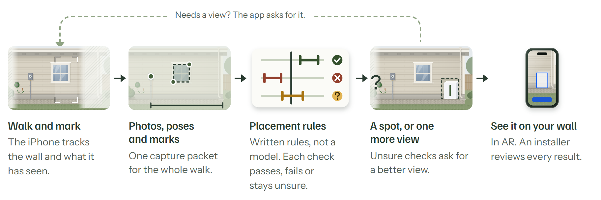
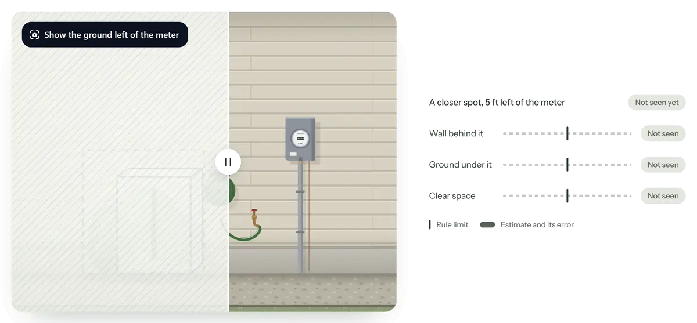

# House scanning

Walk one wall with an iPhone. Find out whether a home battery fits, and where.

[Live site](https://house-scanning.vercel.app/) · [How it works](docs/how-it-works.html) · [Demo API](https://house-scanning-server.vercel.app/health)

<picture>
  <source media="(prefers-color-scheme: dark)" srcset="docs/readme/pipeline-dark.png">
  
</picture>

Today a person at Base Power decides where a battery goes by looking at a homeowner's photos. Photos have no scale, and they miss whatever sits just out of frame, so the answer often waits on another round of pictures.

We're trying to make it one walk. The homeowner scans the outside wall around their electric meter. The app guides them until it has seen everything the placement rules need, then sends what it captured. The server builds a 3D model, decides in plain code whether a battery fits and where, and the app shows the spot in AR.

This is a four-person hackathon project for Base Power, started 2026-09-25. Sam, with AI agents, builds the iPhone app, and Aiden films video and gathers sample data. Hunter, with his own agents, owns the 3D model and the rule checks.

## Quick start

You need [uv](https://docs.astral.sh/uv/), Node 24 with pnpm, and Xcode 26 or newer.

```bash
git clone --recurse-submodules https://github.com/SamGu-NRX/house-scanning-master.git
cd house-scanning-master
make check
```

`make check` runs the server, web and iOS suites that CI runs. On a machine without Xcode, run `make server web`.

No setup at all? The demo server is live:

```bash
curl -s https://house-scanning-server.vercel.app/health
```

## How it fits together

<p align="center">
  
</p>

Models build the geometry and recognize things. Plain code passes or fails each check, so every answer points back to a rule and a measurement. The clearance numbers live in a rules file with their sources, never in code.

| Part | Built with | Where |
| --- | --- | --- |
| iPhone app | Swift 6, SwiftUI, ARKit, RealityKit, XcodeGen | `ios/` |
| Rules engine and API | Python 3.12, FastAPI, uv, pytest, deployed on Vercel | `server/` |
| 3D reconstruction | MoGe-2 learned depth scaled with the ARKit poses, LiDAR depth, Open3D, shapely | `recon/` (PR #20) |
| Reviewer view | TypeScript, Vite, Vitest, Biome | `web/` |
| Landing page | Static site on Vercel | `sites/landing` |

## Unseen means unsure

<picture>
  <source media="(prefers-color-scheme: dark)" srcset="docs/readme/unseen-dark.webp">
  
</picture>

This is the rule we care about most. A gap in the scan could hide a gas meter, so ground nobody saw never counts as clear. Here the walk went right and never saw the left side. The closer spot stays "Not seen yet" until the view sweeps across. Then there isn't enough clear space in front of it, so it's out.

The same idea covers error. The phone tracks itself by dead reckoning, so its error grows the farther you walk. A check passes only when the margin beats the error, and fails only when it misses by more. Everything in between is UNSURE, and the app names the view that would settle it. The values in the animation are illustrative.

## What the server checks

The battery is 31 × 22 × 39.5 in and stands flush against the wall near the meter. The server slides it along every stretch of wall the scan saw and runs these checks at each spot:

| Check | Rule | Source |
| --- | --- | --- |
| Wall behind it | The whole footprint backs onto one straight wall the camera saw | Base Core's size |
| Ground under it | A surface the rules allow | Demo choice |
| Meter's working space | Stays clear of the 30 × 36 in space in front of the meter | NEC 110.26 |
| Gas meter or pipe | At least 3 ft away | [Base's help page](https://help.basepowercompany.com/en/articles/10280705), Austin Energy §1.9, Texas Gas Service |
| AC units | At least 3 ft away | Base's help page |
| Doors and windows | At least 3 ft away | IRC R328.4 |
| Open space in front | At least 3 ft | Base's help page, for fences |
| Headroom | At least 6.5 ft | NEC 110.26, applied to the battery as a demo choice |
| Wall equipment | Nothing mounted on the wall above it | Demo choice |
| Cable run | At most 20 ft, and a person reviews anything past 15 ft | Base's help page. The 15 ft has no public source |
| Cable route | Can't cross a door, a garage or a gap in the wall | Demo choice |
| Driveway | At least 5 ft away | Placeholder, no public value |
| Pool | At least 10 ft away | Placeholder, no public value |

Each check comes back PASS, FAIL or UNSURE, with the measurement, its error and the reason in words. The values live in `server/rules.yaml` (PR #11) next to their sources, and [docs/04](docs/04-prior-art-and-codes.md) has the full citations. Base's own values load only on the private deployment.

### What goes in and what comes out

Here is the example scene from the server's tests (PR #11), sent to the demo server. The scene is synthetic. The reply is real, trimmed to the parts worth reading.

The server wouldn't place the battery on its own. Its best spot is 9 ft 11 in left of the meter, where an AC unit measures 4 ft 1 in away against a 3 ft rule. The error on that is ± 3 ft 10 in, which is too close to call. So the answer is a manual review, plus a request to keep walking past the left end of the wall.

<details>
<summary><code>scene.json</code>, what the phone sends (abridged)</summary>

```json
{
  "schema_version": "1.0",
  "meter": { "pos": [0.0, 5.0, 0.0], "wall_id": "side", "plus_minus_ft": 0.3 },
  "walls": [
    { "id": "back", "baseline": [[-14.0, -18.0], [-14.0, 0.0]], "height_ft": 9 },
    { "id": "side", "baseline": [[-14.0, 0.0], [22.0, 0.0]], "height_ft": 9 }
  ],
  "objects": [
    { "type": "gas_meter", "wall_id": "side", "span_ft": [-5.0, -4.0], "source": "tap" },
    { "type": "window", "wall_id": "side", "span_ft": [3.0, 6.0],
      "attrs": { "operable": true }, "source": "vlm", "conf": 0.86 },
    { "type": "ac", "wall_id": "back", "span_ft": [-20.0, -17.0], "source": "tap" }
  ],
  "coverage": {
    "ends": { "left": { "kind": "unexplored" }, "right": { "kind": "limit" } },
    "observed": [
      { "band": "wall", "span_ft": [-26.0, 22.0] },
      { "band": "ground", "span_ft": [-26.0, 26.0], "out_ft": 14.0 }
    ]
  },
  "keyframes": [
    { "id": "k1", "img": "k1.jpg", "intrinsics": [1450.0, 1450.0, 960.0, 720.0],
      "pose": [1, 0, 0, 0, 0, 1, 0, 0, 0, 0, 1, 0, 2.0, 4.5, 9.0, 1] }
  ]
}
```

</details>

<details>
<summary><code>result.json</code>, what the server sends back (abridged)</summary>

```json
{
  "decision": "manual_review",
  "summary": "A person needs to check the best spot, 9 ft 11 in left of the meter: distance from ac units. Demo rules: public values and placeholders (pool 10 ft, drive 5 ft), not Base's.",
  "spot": { "outcome": "unsure", "wall_id": "side", "span_ft": [-11.24, -8.65], "route_length_ft": 9.65 },
  "checks": [
    {
      "id": "gas_clearance", "outcome": "pass",
      "measured_ft": 3.65, "plus_minus_ft": 0.6, "threshold_ft": 3.0, "comparison": "at_least",
      "reason": "Nearest gas meter or pipe is 3 ft 8 in (± 0 ft 7 in) away, clear of the 3 ft 0 in rule, and the area around the battery was seen."
    },
    {
      "id": "ac_clearance", "outcome": "unsure",
      "measured_ft": 4.08, "plus_minus_ft": 3.8, "threshold_ft": 3.0, "comparison": "at_least",
      "reason": "objects[3] ac is 4 ft 1 in (± 3 ft 10 in) from the battery against a 3 ft 0 in rule: too close to call."
    }
  ],
  "missing_evidence": [
    { "kind": "past_end", "side": "left",
      "message": "Keep walking past the left end of the scan (32 ft 0 in left of the meter): a spot within reach may be there." }
  ],
  "stats": { "candidates": 948, "pass": 0, "unsure": 423, "fail": 525, "elapsed_ms": 541.8 }
}
```

</details>

## Reproduce the demo

Most of the working system is still in open pull requests. `main` has an AR session that shows tracking and a server skeleton. Check out the PR you need with the [GitHub CLI](https://cli.github.com).

**Ask the demo server for a placement.** It runs the engine from PR #11 with public rules only, and every answer says so.

```bash
gh pr checkout 11
curl -s https://house-scanning-server.vercel.app/v1/placements \
  -H 'Content-Type: application/json' \
  --data-binary @server/tests/fixtures/example-scene.json
```

Post the same scene to `/v1/placements/site-plan.svg` to get a drawing of the wall with the chosen spot.

**Run the server yourself.**

```bash
gh pr checkout 11
cd server
uv sync --locked
uv run uvicorn api:app --host 0.0.0.0 --port 8000
```

**Run the app.** Guided capture is in PR #10, a different branch from the server's, so check it out first:

```bash
gh pr checkout 10
```

In the Simulator, build `ios/HouseScan.xcodeproj` and pass the launch arguments `-replay <capture folder> -autopilot -serverURL https://house-scanning-server.vercel.app`. On an iPhone, set up signing first:

```bash
cp ios/Config/Local.xcconfig.example ios/Config/Local.xcconfig
```

Then set `DEVELOPMENT_TEAM` and `BUNDLE_ID_PREFIX` in that file, plug the phone in, and run. Don't set the team in Xcode's Signing pane, because CI fails on the change it writes to the project.

### Environment variables

There are no third-party API keys. The server runs the public rules with nothing set. These are all optional:

```bash
# server/.env  (git ignores .env files; load it with: uv run --env-file .env uvicorn api:app)

# "strict" sends every would-be pass or fail to manual review instead of deciding.
# HOUSESCAN_POLICY=strict

# Base's rules, merged over the public ones. Set one of these two, never both.
# HOUSESCAN_PRIVATE_RULES=../private/rules.yaml
# HOUSESCAN_PRIVATE_RULES_B64=<the same YAML, base64-encoded, for Vercel>

# Required once private rules load. Every request then needs it, except /health and CORS preflight (OPTIONS).
# HOUSESCAN_API_KEY=<a long random string you choose>
```

The reconstruction worker in PR #20 reads `HOUSE_SCANNING_DATA` (default `~/house-scanning-data`) for public datasets and model caches, and `HOUSESCAN_SERVER` for the server to post to. TestFlight uploads use repository secrets described in [CONTRIBUTING.md](CONTRIBUTING.md).

## Data and where it came from

| Data | What we used it for | Source | In git? |
| --- | --- | --- | --- |
| [ADVIO](https://github.com/AaltoVision/ADVIO) | Tracking drift on a 2018 iPhone 6s | Public, CC BY-NC 4.0 | No |
| MARViN | Tracking drift on an iPhone 14 Pro Max | Public, no license stated | No |
| [ETH3D](https://www.eth3d.net) | Wall error against a laser scan | Public, CC BY-NC-SA 4.0 | No |
| Meter photos | Reading the meter number (PR #16) | Photos of real meters taken for this test | No, `data/` |
| Field runs | The app's first run on a phone (PR #23) | Our TestFlight build on a real wall | No, `captures/` |
| Rule values | The rules engine | Public pages and building codes, each cited in [docs/04](docs/04-prior-art-and-codes.md) | Yes |
| Test fixtures | Server and packet tests | Synthetic, written by hand | Yes |
| Drawings and animations | This README, the site, the walkthrough | Illustrations with example values, not a real house | Yes |

The public datasets are used only to measure accuracy and are never redistributed. ADVIO and ETH3D are licensed for noncommercial use, so anyone relying on these results for commercial work needs permission from their authors first. Base's own rules and materials stay in the git-ignored `private/` folder. Photos of real homes never enter git.

## What we've measured

Most of these numbers come from public datasets with laser-scanned or surveyed ground truth. Only the meter photos and the first phone run are ours.

| What | Result | Source |
| --- | --- | --- |
| Tracking drift, current iPhone | 8.6, 13.4 and 18.5 in (p90) after 10, 20 and 30 ft, inside the server's allowance of 19.2, 38.4 and 57.6 in | MARViN, iPhone 14 Pro Max, PR #12 |
| Tracking drift, 2018 iPhone | Two to three times over that allowance | ADVIO, iPhone 6s, PR #12 |
| Learned depth on its own | Scale 4 to 12% off, which puts walls about 20 in out (p90) | ETH3D, PR #12 |
| Learned depth, rescaled with the phone's poses | Walls within about 5 in (p90), or 2.8 in with exact poses. Edges stay at 8 in or worse | ETH3D, PR #12 |
| Reconstruction worker | Walls within 2.1 in (p90) with a laser scan standing in for LiDAR, and 2.8 in from photos only | ETH3D, PR #20 |
| Reading the meter number | Read in full on 71 of 73 photos, but the right line on only 21 of 75. A list of three candidates held it on 27 of 34 held-out photos | Photos of real meters, PR #16 |
| First run on our phone | Both wall ends landed at the meter, so the server placed no spot. Two of five features came within 4 in of the tape | TestFlight build, PR #23 |

## Known limitations

- **Most of it isn't merged.** Guided capture (PR #10), the engine (PR #11), reconstruction (PR #20) and the packet spec (PR #22) all live on branches.
- **The first phone run placed nothing.** It set both wall ends at the meter, so the server had no wall to search (PR #23).
- **The 3D method is still open.** Learned depth alone is about 20 in off. Rescaled with the phone's poses it gets to about 5 in (p90), but edges stay at 8 in or worse. With depth from a laser scan standing in for LiDAR, walls land within 2.1 in.
- **Our tracking evidence comes from a LiDAR phone.** A current iPhone stayed inside the error allowance, but it had LiDAR, and most homeowners' phones don't. A 2018 iPhone ran two to three times over.
- **Hidden wall has no owner.** Something standing in front of the wall can hide it, and nothing checks for that on phones without LiDAR yet.
- **Two rule values are placeholders.** No public value exists for the pool (10 ft) and the driveway (5 ft).
- **Meter reading picks the wrong line.** The phone reads the number but chose the right line on only 21 of 75 photos, so the app offers three candidates to tap.
- **The electrical panel is out of scope.** An electrician still reviews it.

## Next steps

1. Run the field test on a current iPhone without LiDAR, using `experiments/evals/field/FIELD_SHEET.md` (PR #12), and check the default error bars against a tape.
2. Pick the 3D path, and try world models, which nobody has tested yet.
3. Decide who checks for hidden wall. One idea is to show the homeowner the photo of the chosen spot and ask.
4. Load Base's values into the private deployment in place of the placeholders.

## Repository map

Paths marked with a pull request exist only on that branch until it merges.

| Path | What it is | State |
| --- | --- | --- |
| `ios/` | The iPhone app | On `main`, an AR session that shows tracking. Guided capture is in PR #10, and the live 3D map in PR #21 |
| `packet/` | The capture packet's spec, validator and samples | PR #22 |
| `server/` | The rules engine and placement API | On `main`, a skeleton. The engine is in PR #11 |
| `recon/` | Turns photos and depth into a 3D model and a coverage map | PR #20, handed to the server team |
| `experiments/` | One folder per experiment | Accuracy evals in PR #12, Measure Lab in PR #7, scoring in PR #4, meter reading in PR #16, the first device field test in PR #23 |
| `web/` | Browser toolchain for a reviewer view | No page on `main` |
| `docs/` | The overview, the walkthrough, public rules and code citations, and the live-survey design | |
| `.agents/skills/` | Shared agent skills for writing, planning and review, linked from `.claude/skills/` | |
| `sites/landing` | The landing page, a submodule | Change it in its own repository |

To go deeper, start with [the walkthrough](docs/how-it-works.html), about fifteen minutes with pictures. [docs/00-overview.md](docs/00-overview.md) has the plan, the decisions and the evidence, [AGENTS.md](AGENTS.md) the rules for anyone changing this repository, and [CONTRIBUTING.md](CONTRIBUTING.md) branches, CI and TestFlight.

This repository is public. The pictures above come from the [live site](https://house-scanning.vercel.app/).
