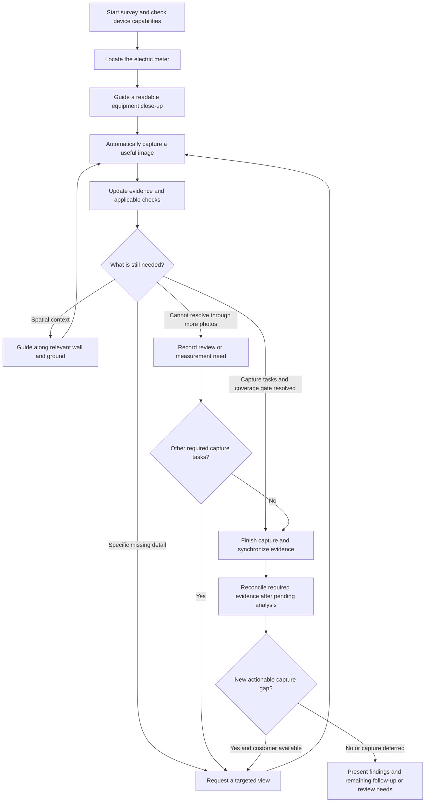
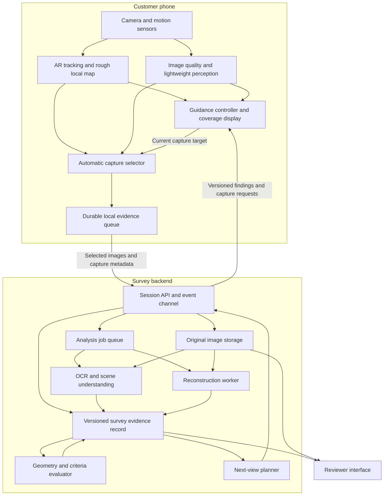
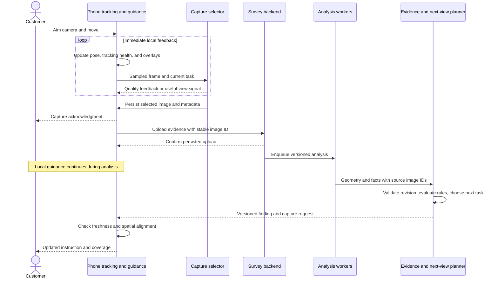
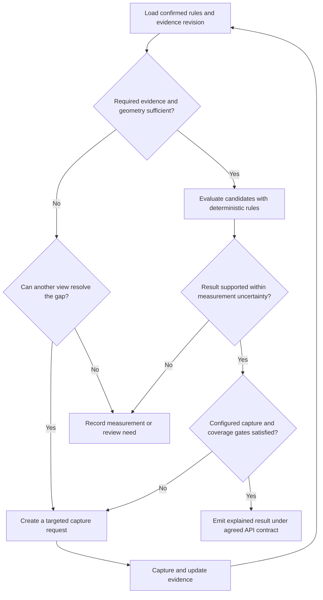

# Base Power — Live Guided Site Survey

> Day-1 plan from 2026-09-25, kept for its reasoning and citations. Where it conflicts with [00-overview.md](00-overview.md) or a component README, those win.

**High-Level Design · v0.1 · September 25, 2026**

**Status:** Public architecture proposal for review; no implementation or existing lane decisions are changed by this document.

**Audience:** Product, engineering, ML, and Base survey reviewers.

> Build a survey that understands what the customer is showing, requests the next useful view, captures it automatically, and progressively produces an evidence-backed assessment.

This document describes the intended system, not an implemented or benchmarked product. Library capabilities below come from official documentation and repositories; their performance and accuracy on Base surveys remain to be measured. Diagrams use Mermaid syntax and render in Markdown viewers with Mermaid support.

## 1. Context and design status

Base customers currently supply site-survey photographs used to assess electrical equipment and possible battery installations. The proposed experience keeps the camera open while the app guides the customer, chooses useful photographs, and develops a spatial understanding of the relevant exterior.

The repository baseline is documented in [the overview](00-overview.md), [feature map](01-feature-map.md), and [implementation plan](02-implementation-plan.md). This HLD records the proposed continuous capture and guidance experience, with public technical resources. Business-rule values and their authority are maintained separately through the approved rules configuration. This public document contains no team-only criteria material.

| Status | Decision |
|---|---|
| **Product alignment** | Keep the camera open; the app chooses when to capture useful images. |
| **Product alignment** | Analyze the live view to understand relevant objects, observed areas, and missing evidence. |
| **Product alignment** | Show the customer where to move and where to aim, updating guidance during capture. |
| **Product alignment** | Upload selected images during the session and progressively update reconstruction and assessment. |
| **Proposed** | Use native AR for stable spatial guidance, with a simpler camera-guidance fallback. |
| **Proposed** | Keep immediate tracking and feedback on the phone; run heavier analysis and reconstruction asynchronously. |
| **Experiment proposal** | Compare periodic MapAnything and stateful LingBot-Map reconstruction alongside the native AR geometry baseline. |
| **Decided** | Native Swift capture in `ios/`; LiDAR optional. |
| **Open** | Select representative iPhones, GPU environment, and acceptable latency/cost. |
| **Open** | Confirm the versioned rules configuration and aggregation contract before expanding automated decisions. |

### Relationship to the existing repository plan

The current plan targets an iPhone demo with native Swift, ARKit/RealityKit, and LiDAR geometry where supported. It uses native AR measurements and a deterministic server-side placement solver, retaining tap-to-mark capture as a dependable fallback. Capture is native Swift in `ios/`, and LiDAR is optional. The existing implementation plan remains the baseline until the team adopts a change.

| Existing baseline | Proposal in this HLD |
|---|---|
| Meter anchor, explicit wall-end/corner taps, and movement-based frame recording | Add adaptive instructions and useful-image selection; retain tap fallbacks and the existing required coverage gate. |
| Foreground upload of a completed capture bundle | Add incremental evidence transfer and background feedback; preserve a final synchronized evidence bundle. |
| Native AR wall/ground geometry and optional depth | Evaluate learned reconstruction as a challenger or refinement, not a prerequisite for the placement solver. |
| Server-side recognition and deterministic placement | Add local image-quality feedback and a server next-view planner; placement remains plain code. |
| Gemini detection, SAM 2 segmentation, and native Apple Vision checks in the research plan | Treat newer OCR/segmentation models as benchmark candidates, not silent replacements. |
| iPhone demo | Keep Android and browser AR references as future portability research, outside the initial demo commitment. |

The evidence record below extends the existing `scene.json` concept rather than replacing its contract. Proposed metadata additions require coordination with the lane owners. Preserve its existing units at interfaces with explicit conversions, and keep AR results relative to the meter anchor using gravity world alignment.

### Objectives

- Collect readable equipment details and sufficient spatial evidence with minimal customer effort.
- Identify missing evidence before the customer finishes the survey.
- Explain each finding using original images, extracted facts, and the applicable rule.
- Support a growing model during capture without making camera guidance wait for reconstruction.
- Make capture completeness explicit; retain the current required wall-end coverage gate unless the team approves a different completion policy.

### Scope boundaries

The initial scope is the meter, candidate battery areas, and their relevant surroundings. Additional equipment and context views follow the configured survey task list. A complete house or roof model is not required by default. A photorealistic asset is optional; reliable equipment evidence and geometry are the core outputs.

## 2. Customer journey

The customer sees the camera, one current instruction, an aiming target, and a compact coverage display. Separate cues communicate **where to stand** and **where to aim**. Captures produce a brief visual or haptic acknowledgment; the customer does not repeatedly press a shutter.

**Example:** The app captures a readable meter label, then asks for a wider view of the wall and ground. A potential battery area appears, but its clearance from nearby equipment is uncertain. The app requests a view from another angle, automatically captures it, and updates that particular finding. If the area fails, it searches for another reachable candidate.

### Coverage display

| Display | Meaning |
|---|---|
| Gray | Area has not been observed. |
| Yellow | Area was observed, but relevant evidence is incomplete or uncertain. |
| Green | Usable evidence exists for the current capture requirement; this does **not** itself mean installation approval. |

Coverage follows observed surfaces and required details, not the customer's walking trail. A wall can have sufficient image coverage while the ground beneath it remains unknown. Unseen corners remain unknown; the app does not invent the house footprint to complete a minimap.

Show upload and processing progress separately from evidence completeness. Offer “I cannot access this area” so the planner can retain the gap and continue other useful tasks.

## 3. System architecture

The architecture has two cooperating loops:

- **Immediate phone loop:** camera tracking, lightweight quality checks, overlays, local coverage estimates, and automatic capture.
- **Background evidence loop:** reconstruction, deeper perception, criteria evaluation, and improved capture requests.

These are logical responsibilities, not a requirement for separate microservices. The hackathon implementation can use one backend application, a GPU worker, object storage, and a metadata database. Use authenticated HTTPS for image transfer and an event channel such as WebSocket for small status and guidance updates.

### Component responsibilities

| Component | Responsibility | Output |
|---|---|---|
| Device capability adapter | Select supported camera, tracking, depth, and capture capabilities | Capability profile and available capture modes |
| AR tracking | Estimate phone pose; maintain local anchors and tracking health | Pose, coordinate frame, observed geometry |
| Live perception | Assess image quality and recognize currently relevant features | Objects, text candidates, quality feedback |
| Capture selector | Retain sharp, useful views with sufficient overlap or new information | Original image and synchronized metadata |
| Evidence record | Preserve observed facts, uncertainty, provenance, and revisions | Shared survey state |
| Reconstruction worker | Produce or refine scene geometry from selected views | Versioned geometry, poses, confidence signals |
| Criteria evaluator | Apply the configured rules to supported facts and geometry | Per-check findings and missing evidence |
| Next-view planner | Choose a useful achievable observation that addresses a gap | Target, instruction, and completion condition |
| Guidance controller | Convert the current task into stable on-screen guidance | Movement cue, aiming target, capture acknowledgment |
| Reviewer interface | Inspect evidence, measurements, rule application, and uncertainty | Human disposition with recorded rationale |

## 4. Continuous capture and guidance

### Three image uses

1. **Live preview:** a smooth camera view for the customer.
2. **Analysis samples:** downscaled frames for quality checks and suitable lightweight models.
3. **Selected evidence images:** sufficiently detailed original captures for reconstruction, OCR, and later review.

Do not run every model on every preview frame. Sampling cadence should adapt to device load, movement, task, and connectivity. Google's [ARCore ML integration guide](https://developers.google.com/ar/develop/java/machine-learning) explicitly supports processing camera images for ML and recommends reducing inference frequency to manage processing cost.

Preview frames and higher-resolution captures can have different crops, dimensions, and calibration. Preserve the metadata associated with the actual saved image rather than assuming preview geometry applies unchanged. Follow the repository contract: save sensor images unrotated in landscape orientation with their matching intrinsics; any deliberate rotation must also transform the intrinsics and all image-space annotations.

### Automatic capture gate

Capture when the image is useful for the active task or adds necessary reconstruction coverage:

- The relevant object or surface is in frame at an appropriate size and angle.
- Blur, exposure, and glare are acceptable for that task.
- The frame adds information or supplies needed overlap; it is not merely a duplicate.
- Tracking is sufficient when the task needs a spatially registered image.
- Required detail, such as a complete label or visible ground edge, is present.

Maintain overlapping intermediate views during movement as well as targeted close-ups. Saving only isolated endpoint photographs could undermine reconstruction. A clear label photograph may remain useful even when its spatial registration is unavailable; mark the limitation explicitly.

### Next-view planning

Begin with a deterministic task planner built around evidence gaps. More advanced learned planning can be evaluated later.

Each capture request specifies a **reason**, **target object/surface**, **desired view**, **acceptance condition**, and **priority**. Prioritize information that can resolve an active decision, subject to customer effort, observed access, and current tracking quality.

Examples include “show the ground below this wall,” “capture the entire meter enclosure,” and “show the next reachable wall around this visible corner.” Do not guide through an unobserved route as if it were known to be traversable. When geometry is uncertain, use descriptive guidance instead of a precisely anchored walking arrow.

Keep the current task stable while the customer completes it. Replan when it is satisfied, becomes infeasible, or new evidence materially changes the next best action; avoid alternating instructions on each model update.

## 5. Reconstruction and coordinate alignment

### Representation strategy

| Representation | Purpose |
|---|---|
| Original photographs | Source evidence for labels, condition, identity, and review |
| Rough local AR map | Responsive pose tracking, observed surfaces, and guidance anchors |
| Structured scene record | Named walls, ground patches, equipment, openings, routes, and candidates |
| Refined geometry | Distances, footprint fit, headroom, and route calculations |
| Optional mesh or Gaussian splats | Review navigation and visual explanation |

Observed, inferred, and unknown regions must remain distinguishable. Generated surfaces cannot establish the absence of obstacles or satisfy a clearance rule. A photorealistic rendering is not evidence that the geometry is accurate.

### Reconstruction strategy

**Reconstruction experiment:** periodically reconstruct selected accumulated views with [MapAnything](https://github.com/facebookresearch/map-anything), explicitly selecting `facebook/map-anything-apache`. Its interface accepts image sets and optional calibration, pose, and depth inputs. Repeated updates and alignment are application responsibilities; the documented interface is not a persistent live-stream session.

**Streaming experiment:** [LingBot-Map](https://github.com/robbyant/lingbot-map) retains state across incoming frames. Its [demo implementation](https://github.com/Robbyant/lingbot-map/blob/main/demo.py) demonstrates incremental model calls, but a network ingestion service and continuously updating mobile interface still need to be implemented. Evaluate long-sequence behavior and drift, not just attractive short demonstrations.

Use a common result contract while preserving different scheduling semantics. For periodic snapshots, limit work in flight and coalesce superseded jobs only when the replacement contains the necessary evidence. For stateful streaming, preserve ordered per-stream sequence IDs and cache/checkpoint identity; do not arbitrarily skip, duplicate, or reorder model updates. After gaps or interrupted state, resume from a valid checkpoint or rebuild from retained evidence. Retain original evidence regardless of processing strategy. Final refinement may run after capture finishes.

### Spatial consistency

Every geometry result identifies its coordinate frame, scale provenance, tracking epoch, and revision. Save image timestamp, camera pose, intrinsics, orientation/crop transforms, and depth metadata where available.

Use `worldAlignment = .gravity`, not `.gravityAndHeading`, and attach AR results to the meter anchor, as required by the repository. Maintain an explicit validated transform between that anchored live map and each server reconstruction. If scale is unresolved, do not treat a rigid pose alignment as proof of metric consistency. Keep units explicit and preserve the existing `scene.json` feet-based interface; an internal metric representation must convert at that boundary rather than silently changing the schema.

When tracking resets or alignment fails, suspend unsupported spatial overlays and guide relocalization. New reconstructions must not silently move arrows or overwrite newer findings. Map and pose revisions can invalidate earlier measurements; dependent findings must then be recomputed.

## 6. Shared evidence and decision state

The survey evidence record is the application’s persistent understanding of the site. A reconstruction model's internal cache is not a replacement for this record.

| Record | Essential information |
|---|---|
| Survey session | Session ID, device capabilities, criteria profile/version, capture lifecycle, tracking epochs |
| Evidence image | Stable ID, original asset, timestamp, capture metadata, quality, upload acknowledgment |
| Observation | Object/surface identity, original image references, text or semantic fact, uncertainty, model version |
| Geometry revision | Frame ID, units, scale source, alignment transform, input evidence, uncertainty |
| Coverage region | Observed surface, relevant views, occlusion, image quality, unmet evidence requirements |
| Candidate location | Battery footprint, wall association, route, constraints, supporting evidence |
| Finding | Check ID, configured result, policy version, evidence IDs, rationale, unresolved dependencies |
| Capture request | Evidence gap, target, desired viewpoint, completion condition, priority, originating revision |
| Review record | Human decision, rationale, evidence inspected, and audit history |

Track confidence separately for **readability**, **object interpretation**, **coverage**, **geometry**, and **rule sufficiency**. Model confidence values require calibration before they can drive automatic decisions. Duplicate or strongly correlated views are not independent confirmations; confidence need not increase as photographs accumulate.

Use separate fields for:

- **Capture lifecycle:** active, paused, capture complete, or abandoned.
- **Synchronization/processing:** pending, uploaded, analyzing, or settled.
- **Evidence action:** more capture, external measurement, human review, or none.
- **Finding result:** the versioned public API result contract agreed with the solver and reviewer interfaces.

“Capture complete” means the current capture tasks are resolved or explicitly deferred. It does not mean uploads are finished, processing is settled, or the installation is approved.

Before presenting a settled assessment, reconcile all required evidence against accepted analysis results. Late results can reopen capture while the customer is present, create a follow-up capture request, or mark the survey incomplete/reviewable when recapture is unavailable. Show this transition explicitly; an earlier capture-complete state must not conceal a newly discovered gap.

## 7. Deterministic criteria evaluation

Perception extracts observable facts. Geometry supplies measured or estimated spatial relationships with uncertainty. Plain code evaluates the confirmed, versioned rule configuration. Vision models must not make the placement decision.

### Public rule and evidence contract

| Responsibility | Contract |
|---|---|
| Rule configuration | Keep every clearance and equipment dimension in `rules.yaml`, with its source (a code citation, Base's public help page, or a labeled demo placeholder) and applicability metadata; never hardcode them in capture logic. |
| Perception | Associate recognized objects and text with original images and an uncertainty estimate. |
| Geometry | Keep coordinate frame, units, scale provenance, error bounds, and evidence references with each measurement. |
| Solver | Evaluate the configured rules using the repository's wall-line and polygon approach; expose which observations support each check. |
| Missing evidence | Create a targeted capture request when another view can resolve the uncertainty. |
| Human judgment | Preserve a review path for uncertain measurements, interpretation, or unresolved configuration. |
| Aggregation | Use the agreed API contract to combine findings; a successful individual check does not establish overall completion. |

The public-source starting points and unresolved values are recorded in [the feature-map rules table](01-feature-map.md#rules-table-c1-confirm-these) and [public source research](04-prior-art-and-codes.md). This HLD introduces no new rule values and does not resolve disputed requirements. Team-only material stays outside tracked files.

### Decision and recapture flow

The current repository plan requires explicit wall-end coverage; this HLD does not relax that gate. More selective stopping is a future product experiment that needs the team's approval and a public, testable completion contract. Coverage must describe what was actually visible, including relevant wall and ground regions; an occluded region remains unknown even if the customer walked past it.

When measurement uncertainty crosses a configured threshold, request a useful additional observation, a measurement, or review. Repeated photographs are not automatically the right remedy. Retain the distinction between an evidence gap and a judgment that cannot be settled through another image.

## 8. Technology choices and useful resources

### Native capture and guidance

| Resource | What it contributes | Design use and limits |
|---|---|---|
| [Apple ARKit world tracking](https://developer.apple.com/documentation/arkit/arworldtrackingconfiguration) and [ARCamera](https://developer.apple.com/documentation/arkit/arcamera) | Camera pose, imaging parameters, and spatial tracking | Proposed iOS foundation; camera tracking does not itself require LiDAR. Apple platform SDK. |
| [Apple Vision text recognition](https://developer.apple.com/documentation/vision/recognizing-text-in-images) and [barcode detection](https://developer.apple.com/documentation/vision/vndetectbarcodesrequest) | Native iOS image text and barcode analysis | Existing phone-side direction in the repository; validate readability feedback on actual equipment images. |
| [ARKit scene depth](https://developer.apple.com/documentation/arkit/arframe/scenedepth) | LiDAR depth with confidence information | Optional sensor input on supported hardware; check capabilities at runtime. |
| [ARCore fundamentals](https://developers.google.com/ar/develop/fundamentals) and [anchors](https://developers.google.com/ar/develop/anchors) | Camera/motion tracking, planes, and spatially attached overlays | Future Android reference; outside the current iOS demo scope. Texture-poor surfaces and tracking changes need explicit handling. Google platform SDK. |
| [ARCore Depth](https://developers.google.com/ar/develop/depth) | Depth from motion, supplemented by hardware depth when available | Optional richer geometry; depth hardware is not universally required, and device support varies. |
| [ARCore ML camera integration](https://developers.google.com/ar/develop/java/machine-learning) | Camera-image access, model integration, and image-to-view coordinate conversion | A direct implementation reference for detection overlays. |
| [Unity AR Foundation](https://docs.unity3d.com/Packages/com.unity.xr.arfoundation@6.1/manual/index.html) | Shared AR interfaces backed by platform provider plug-ins | Alternative if the team prefers Unity and cross-platform development; does not remove native capability differences. |
| [Browser video frame callbacks](https://developer.mozilla.org/en-US/docs/Web/API/HTMLVideoElement/requestVideoFrameCallback) and [OpenCV.js camera processing](https://docs.opencv.org/4.11.0/dd/d00/tutorial_js_video_display.html) | Browser frame analysis and image processing | Useful fallback/prototype for camera coaching. A browser camera feed alone does not provide a persistent AR world map. |

**Platform scope:** preserve the iPhone target. Capture is native Swift in `ios/`. The proposed direction is native AR capture, with camera-and-motion and optional-depth modes evaluated on actual test devices. Android and browser references are future options. Keep the backend independent of the mobile framework.

### Perception, reconstruction, and review

| Resource | Role and maturity | Selection note |
|---|---|---|
| [MapAnything](https://github.com/facebookresearch/map-anything) | Learned multi-view geometry with optional sensor priors | Periodic reconstruction challenger. Use the Apache checkpoint; the default checkpoint is noncommercial. |
| [LingBot-Map](https://github.com/robbyant/lingbot-map) | Recent streaming reconstruction with persistent context | Priority experiment for incremental updates. Apache-licensed repository; validate hardware needs, drift, and end-to-end latency. |
| [COLMAP](https://github.com/colmap/colmap/releases) | Established, actively maintained multi-view reconstruction | Reference comparison for geometry; requires appropriate overlap/texture and scale handling. |
| [Depth Anything 3](https://github.com/ByteDance-Seed/Depth-Anything-3) | Image/video depth and reconstruction alternatives | Challenger. Capabilities and licensing vary: Base/Small Apache; several larger checkpoints noncommercial. |
| [PaddleOCR](https://github.com/PaddlePaddle/PaddleOCR) | Established OCR toolkit; PP-OCRv6 adds relevant industrial-text capabilities | Candidate for meter and panel text. Apache-licensed repository; benchmark actual glare, scratches, and small digits. |
| [PaddleOCR.js](https://github.com/PaddlePaddle/PaddleOCR/tree/main/paddleocr-js) | Official browser OCR, documented with PP-OCRv5 | Useful for immediate readability feedback in a browser fallback. Not a native mobile integration by itself. |
| [SAM 3 / SAM 3.1](https://github.com/facebookresearch/sam3) | Promptable segmentation and video object tracking | Research challenger to the current segmentation baseline. Gated weights/custom license; segmentation does not prove electrical identity or window operability. |
| [Open3D](https://github.com/isl-org/Open3D) | Established point-cloud and mesh processing | Candidate geometry toolkit for registration and surface processing. |
| [Shapely](https://github.com/shapely/shapely) | Established planar geometry operations | Candidate for footprint overlap, distances, and clearance regions; height/headroom require separate 3D logic. |
| [Spark](https://github.com/sparkjsdev/spark) | MIT-licensed Gaussian-splat rendering integrated with Three.js | Optional browser review visualization; do not use rendered splats alone as measurement proof. |
| [RTAB-Map](https://github.com/introlab/rtabmap) / [Stray Scanner](https://github.com/strayrobots/scanner) | Mapping and mobile scan-collection references | Useful experiments or data-collection shortcuts; not complete Base customer workflows. |

### Recent developments to watch without blocking the baseline

| Resource | Relevance | Constraint |
|---|---|---|
| [World Labs Atlas](https://www.worldlabs.ai/blog/atlas) | September 2026 reconstruction/world-model announcement | Proprietary early access; can generate unseen regions. Test only if access is available and preserve observed-versus-generated provenance. |
| [HY-World 2.0 / WorldMirror 2.0](https://github.com/Tencent-Hunyuan/HY-World-2.0) | Image/video reconstruction with exportable 3D representations | Custom community license with restrictions. Evaluate its reconstruction mode separately from world generation. |
| [VGGT-Ω](https://github.com/facebookresearch/vggt-omega) | Recent reconstruction research and September 2026 reference checkpoint | Noncommercial license; research comparison rather than the proposed Base deployment dependency. |

Pin the exact code and weight versions used in a benchmark. “Public repository,” “open weights,” and “commercially usable” are different properties. None of these projects supplies the complete Base-specific next-view planner, capture policy, or validated installation measurements.

## 9. Reliability, latency, and data handling

### Operational behavior

| Condition | Required behavior |
|---|---|
| Slow or missing connectivity | Keep supported local tracking and quality feedback active; persist captures for retry; clearly mark cloud-dependent findings pending. |
| Interrupted upload | Retry using stable evidence IDs; server acknowledgments prevent duplicate processing and premature deletion. |
| Slow GPU worker | Coalesce superseded snapshot jobs; preserve valid ordered streaming state or rebuild it; continue local guidance and show processing status separately. |
| Out-of-order result | Validate session, input revision, tracking epoch, and model version before applying it; never overwrite newer state blindly. |
| Tracking lost or reset | Suspend spatially unsupported arrows; preserve photos; resume through relocalization or a new explicitly aligned epoch. |
| Uncertain map scale/alignment | Retain visual evidence but withhold unsupported metric conclusions and world-anchored overlays. |
| Blur, glare, or poor lighting | Request a specific corrective action; allow review/defer when additional attempts are unproductive. |
| Heat, battery pressure, or memory limits | Reduce analysis/reconstruction cadence before compromising the camera interaction; preserve critical evidence tasks. |
| Newly observed obstacle | Recompute affected candidates and findings; do not retain a prior pass solely for apparent progress. |
| Session resumed later | Restore evidence/task state, but treat spatial relocalization as a separate requirement. |
| Late analysis reveals a missing view | Reconcile evidence, reopen capture or request follow-up, and keep the survey explicitly incomplete/reviewable until resolved. |

### Performance evaluation

Treat camera smoothness, local feedback, upload delay, reconstruction time, and planning latency as separate measurements. Proposed initial goals are local quality feedback within **500 ms at p95** and useful server feedback within **5 seconds at p95** under an explicitly recorded reference device/network/GPU setup. These are test targets, not measured capabilities or promises across customer devices. Dense final reconstruction may take longer.

Record end-to-end timestamps for capture, upload acknowledgment, analysis start/end, and instruction display. Include cold starts, queue delay, and thermal behavior. Tune capture frequency and workload after testing the actual pipeline.

### Data handling

Authenticate survey access and isolate sessions. Store original photos separately from derived assets, protect transfers and storage, and use scoped access for reviewer images. Persist only necessary analysis frames; continuous raw-video retention is not assumed. Define retention/deletion periods with Base before deployment, including local device copies and intermediate model outputs. Capture IDs and revision history support reproducibility without placing full images or meter identifiers in routine logs.

## 10. Hackathon implementation plan

### Phase 1 — Prove the closed loop

Use one target device, a meter, and one candidate battery area. Demonstrate automatic capture, one real evidence gap, a targeted corrective instruction, a second capture, and an updated explained finding. Include a visible case where additional evidence changes the initial assessment.

Use confirmed public-source rules or clearly labeled synthetic test configuration. Unresolved rule values remain configuration gaps; do not present a synthetic demonstration as installation approval. Provide a basic review screen with original images and the reason behind each result.

### Phase 2 — Add progressive spatial understanding

Integrate periodic reconstruction, coordinate alignment, observed-surface coverage, and a virtual battery footprint. Compare ordinary camera-and-motion capture with optional depth input on the same scene. Preserve image evidence when geometry fails.

### Phase 3 — Evaluate streaming and broader coverage

Test LingBot-Map behind the same reconstruction interface. Expand to adjacent walls, interrupted sessions, panel tasks, and representative phones. Adopt streaming only if its measured benefit exceeds integration, compute, and reliability costs.

## 11. Validation and acceptance scenarios

Use the same captured homes and independently recorded dimensions for comparisons. Include glare, texture-poor walls, narrow side yards, hidden corners, multiple meters, gates, and borderline clearances. Keep the current photo-prompt workflow as a baseline.

| Scenario | Expected result |
|---|---|
| Customer supplies repeated near-identical frames | No artificial increase in coverage or independent confidence. |
| Equipment text is unreadable or ambiguous | Targeted recapture or review; uncertain OCR does not become a verified fact. |
| Customer walks past an area without showing its ground | Ground coverage remains incomplete. |
| Reconstruction changes its coordinate frame | Existing overlays update only after validated alignment. |
| Tracking resets | Misleading spatial guidance is suspended. |
| Earlier server result arrives after a newer one | Newer decisions and instructions remain protected. |
| Streaming frames are retried or arrive out of order | Sequence identity prevents duplicate/reordered state updates; gaps trigger valid recovery. |
| Clearance uncertainty spans the rule threshold | Finding remains unresolved/reviewable; no unsupported automatic pass. |
| A candidate satisfies configured checks | Remaining capture tasks and the current wall-end coverage gate still apply. |
| Required geometry remains hidden | Preserve unknown coverage and apply the configured incomplete-evidence workflow. |
| Rule configuration changes between evaluations | Record both versions and recompute affected findings without mixing results. |
| Connection or session is interrupted | Evidence survives, retries are idempotent, and pending work is visible. |
| Analysis finds a missing view after capture completion | The session reopens or records explicit follow-up/review; it is not silently treated as complete. |
| A check needs human judgment rather than another photo | It routes to review without an endless capture loop. |

Measure incorrect approvals and rejections separately, exact meter-number accuracy, geometric error near decision thresholds, capture completion, customer effort, repeat-photo burden, processing latency, and cost per survey. Report results by device/capture mode and evidence quality. Model agreement and visual attractiveness are not independent ground truth.

## 12. Decisions needed before implementation hardens

1. **Policy:** Which publicly justified rules configuration is confirmed, and how does the result contract combine findings?
2. **Device scope:** How will native capture integrate with the app shell, and which iPhones represent actual customers?
3. **Measurement standard:** What scale anchor and error tolerance are acceptable near each decision boundary?
4. **Deployment:** What GPU, connectivity, latency, and per-survey cost budget are available?
5. **Review handoff:** What evidence package and result format should Base’s existing review process receive?
6. **Data:** Which representative surveys and measured locations can be used for evaluation, and what retention rules apply?

The architecture keeps these choices configurable while preserving the agreed product behavior: an open camera, evidence-driven guidance, automatic useful captures, and a progressively improving assessment.
