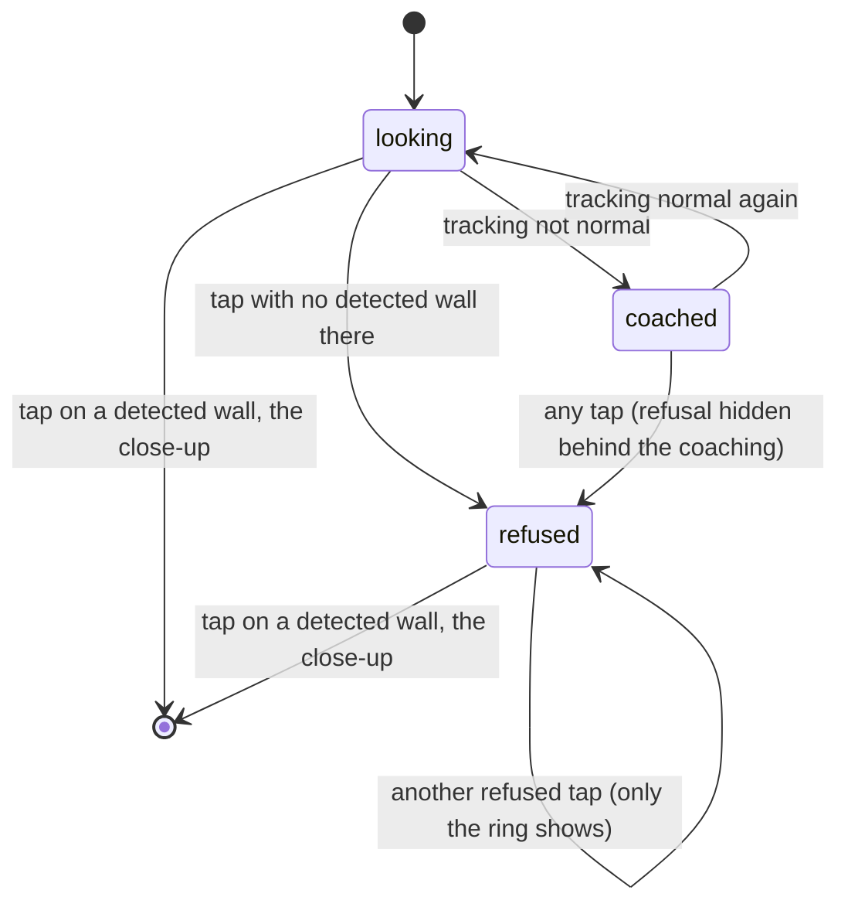

# Finding the meter

## Summary

Finding the meter is where the scan fixes its one wall. The homeowner points the phone at their
electric meter and either taps "This is my meter", which pins the meter at the circle in the
middle of the screen, or taps the meter itself on the camera image. The phone accepts the tap
only where it has detected a real vertical surface; that surface becomes the wall for the rest of
the scan. It is the first camera screen (screen name `findMeter`), reached from "Allow camera" on
the introduction, and again after the phone loses its place for over 20 s during capture
([the flow](../foundations/flow.md#the-interaction-event-by-event)). Nothing is photographed here.
An accepted tap goes straight to [the meter close-up](meter-close-up.md).

## The simple case

The camera opens. A white ring with a dot at its center sits in the middle of the view, and the
instruction reads "Find your electric meter", with "A gray box with a round glass dial or a small
screen, usually on an outside wall." A blue "This is my meter" button fills the bottom of the
screen. The homeowner stands a few steps from the wall, puts the ring on the meter and taps the
button. A ring blooms from the middle of the screen and fades, the phone gives a success haptic,
and the screen crossfades to the close-up.

## The interaction, event by event

### Arriving

The camera fades in behind the screen and stays open through the next screens. The instruction is
"Find your electric meter" and nothing is set: no wall, no photos, and no photo counter on this
screen. On the first arrival the phone starts motion tracking, and iOS asks for camera access if
it has not been granted. While tracking starts up, [coaching](../foundations/coverage-and-guidance.md#one-instruction-at-a-time)
replaces the instruction, usually "Move your phone slowly" ("It's getting its bearings."), with an
amber icon beside it.

Arriving after a 20 s loss of place, the phone has already thrown away the wall, photos and marks
and restarted tracking with a fresh map, so it has to detect the wall again before a tap can
succeed.

### Leaving at once

The only way off this screen is an accepted tap. There is no back button, no skip and no Start
over. Nothing is recorded until the tap is accepted.

### First capture

Two gestures do the same thing:

- **"This is my meter"** pins the point under the ring in the middle of the screen. A ring blooms
  at the screen's center.
- **A tap on the camera image** pins the point under the finger. A ring blooms where the finger
  touched.

The ring blooms at once for every tap, accepted or not. The tap is accepted when both hold:

1. Tracking is normal.
2. The point lies on a vertical surface the phone has detected, or on that surface continued past
   the part it has detected so far. A surface the phone would only be guessing at does not count.

If the first check fails, the tap is refused and nothing changes while the coaching is up. If the
second fails, the instruction changes to "Step a little closer to the wall", with "Then aim at
your meter again." The refusal has no warning icon and no haptic, and the new instruction stays
until a tap is accepted.

> Technical note: when the tap is accepted, the wall's outside is the side the phone is on, and
> the ground at the wall is the highest detected level surface at least 0.3 m (1 ft) below the
> meter whose detected extent comes within 2 m (6 ft 7 in) of it. With no such surface yet, the
> ground is taken as 1.4 m (4 ft 7 in) below the phone (`Runtime/ScanEngine+Actions.swift:41-42`,
> `:53`). The lookup runs again whenever the phone detects or grows a level surface, for the rest
> of the scan: the first match replaces the guess, and a later one replaces the ground when it
> differs by more than 1 cm. Every mark is re-measured against the new ground
> (`Runtime/ScanEngine.swift:227-246`). While the ground is still a guess, the upload marks the
> meter and each door, window, gas meter and AC unit as uncertain by ±0.3 m (`Runtime/ScanEngine+Export.swift:50-55`, `:72`).

### While capturing

Nothing is captured on this screen. Only the coaching updates while it is up, as the phone's
tracking changes: "Slow down", "Aim at a corner or somewhere with more texture", "Point at the
meter like this.", "Your phone lost its place". This screen never shows "Hold steady" or "It's too dark to
see the wall", which belong to the walk. The homeowner can tap as often as they like; each refused
tap shows the ring and nothing else.

### Advancing

An accepted tap sets the wall: the meter's position, which way the wall runs and which side is
outside. Coverage starts empty, centered on the meter. The phone pins the meter to the wall so its
position is refined as tracking improves. The success haptic fires and the close-up appears at
once, with no pause on this screen.

## Modifiers

| Modifier | At arrival | While capturing |
| --- | --- | --- |
| Live camera or replay | A replay shows the recording's first frame as a still. No coaching appears, because that frame is shown for tapping and is not checked. | Any tap or "This is my meter" is accepted at once, wherever it lands. The wall comes from the recording (its recorded wall, or one assumed from the path the camera took), not from the tap. |
| Autopilot | A badge reads "Replay · Autopilot". The screen stays up for the autopilot's hold ([the flow](../foundations/flow.md#modifiers)), then the autopilot presses "This is my meter" itself. With the live camera it does nothing, and the badge reads "Autopilot". | No effect. |
| Server or sample result | No effect. | No effect. |
| Larger text sizes | The instruction and the button label grow. When they no longer fit, the screen scrolls instead of shrinking the text. The ring in the middle does not grow. | No effect. |
| Reduce Motion | The screen crossfades in over 0.15 s. | The ring from a tap fades in place without growing. A changed instruction crossfades without blurring. |

## Cancel and interrupt

| Event | Before any tap | After a refused tap |
| --- | --- | --- |
| The screen's own way out | None. | None. |
| Start over | Not offered. | Not offered. |
| Tracking limited | Coaching replaces the instruction, and taps are refused without any change on screen. | Same. When the coaching clears, "Step a little closer to the wall" shows, even if the refusal was about tracking. |
| Tracking lost or relocalizing | "Point at the meter like this." or "Your phone lost its place". Taps are refused. After 20 s of relocalizing, tracking restarts with a fresh map and the screen stays. | Same. The "Step a little closer to the wall" instruction stays after the restart. |
| App backgrounded or a call | The screen stays. When the camera resumes, "Point at the meter like this." shows until tracking is normal. | Same. |
| Camera off or session failed | Suspected dead end: the screen stays with no camera image, and taps only show the ring ([the flow](../foundations/flow.md#open-questions-and-verification)). | Same. |
| Network lost or upload failing | No effect. | No effect. |
| App killed | The scan is lost. The next launch starts at the introduction. | Same. |

## Interactions with other systems

**Coverage and evidence.** Coverage begins at the accepted tap, empty and centered on the meter;
the tap's wall is the only wall coverage is ever measured on. **Stored photos.** None; the camera
keeps no frames on this screen. **Upload and offline.** No effect. The uploaded scene measures
everything from the meter, wall direction and ground set here. **Accessibility.** The ring and
the camera image are hidden from VoiceOver, so the only way to pin the meter is "This is my meter",
whose hint is "Pins your electric meter at the circle in the middle of the screen". The
instruction and its second line are read as one element, marked as updating often. **Haptics and
motion.** A success haptic when a tap is accepted and nothing for a refusal. A 0.55 s ring blooms
at every tap, and the button shrinks slightly while pressed. **Verification hooks.** `STATE=findMeter`
on arrival. A refused tap with no wall logs "meter tap refused: no vertical plane" (category
`engine`); a refusal for tracking logs nothing. No `GUIDANCE=` line is logged on this screen. A
replay logs where its wall came from when it loads.

## Edge cases

- The meter is placed where the tap landed, not at the meter's middle. A tap on the meter's edge
  or just above it moves the meter's height and position by that much.
- A meter on a wall with little texture (smooth stucco, fresh paint) may never be detected as a
  surface. Taps are then refused over and over with the same instruction.
- Tapping past the edge of the part of the wall the phone has detected is accepted, because the
  surface counts as continuing (see Open questions).
- A replay started with `-replay` whose homeowner taps "Allow camera" before the recording has
  loaded starts the live camera as well (`Runtime/ScanEngine.swift:183`). Read from code only.
- A replay that could not be opened leaves this screen dark, with no way on: every tap is
  ignored.

## Open questions and verification

- The chest-height ground guess is now replaced as soon as a level surface appears, fixed in
  `beede15`. A scan where none ever appears still carries the guess, flagged only by the ±0.3 m,
  which the code calls a hypothesis with no measured spread behind it
  (`Runtime/ScanEngine+Export.swift:70-72`).
- **Suspected bug: the refusal message is misleading and silent on repeat.** Both refusals show
  "Step a little closer to the wall" (`Runtime/ScanEngine+Actions.swift:26`, `:33`), though
  neither is about distance: one is tracking, and the other is a surface not yet detected, which
  can happen at any range. A second refused tap produces the same text with no haptic
  (`UI/ScanRootView.swift:95` warns only for feature marks), so it looks as if the tap did
  nothing.
- **Question: the wall can be extended into empty space.** The tap may land on a detected wall's
  continuation past what was detected (`Runtime/LiveCapture.swift:76`, `existingPlaneInfinite`). A
  tap at a meter on a surface that has not been detected yet can pin the meter on another detected
  wall's continuation, at the wrong depth. The code's comment says a tap "never guesses a depth".
- A 20 s loss of place now returns here only from the capture screens (finding the meter, the
  close-up, the walk, the list and a gap request); the upload and the result keep the scan
  (`Runtime/ScanEngine.swift:469-476`), fixed in `beede15`. The reset still leaves an unfinished
  feature mark in place (`Runtime/ScanEngine.swift:496-522` does not clear it).
- **Question: "Point at the meter like this." with nothing to match.** The relocalizing coaching
  (`UI/Copy/ScanCopy.swift:65-66`) is written for the walk, which shows the saved close-up under
  it. Here no close-up exists yet and no picture is shown, so "like this" points at nothing.
- The live tap, the refusals, the coaching and the camera prompt need the live camera and have not
  been seen running. The Simulator shows only the replay path, where every tap is accepted.

Verified against house-scanning commit `a39d0a5` (t3/ios-mvf).
