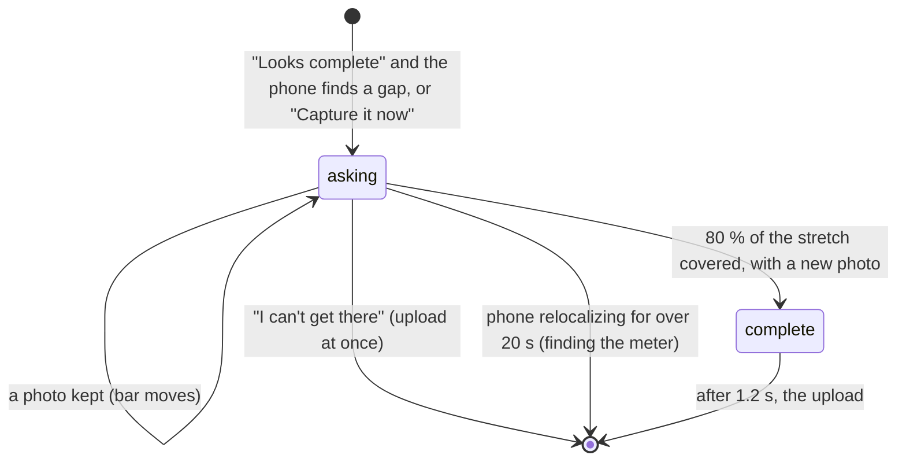

# A gap request

## Summary

A gap request asks the homeowner for one more specific view of the wall or the ground, such as
"Show the ground about 4 ft right of your meter". It comes from two places. The phone asks once,
after "Looks complete" on [marking features](mark-features.md), when its own check finds a stretch
near the meter that no two kept photos show. The server asks when the homeowner taps "Capture it
now" under "Still needed" on [the result](result.md). Either way the screen (screen name
`gapRequest`) is the walk's camera with one target: the requested stretch glows amber, a bar fills
as it is covered, and at 80 % a green check lands and the scan is sent again. "I can't get there"
leaves at any time before that. There is no other way off the screen.

## The simple case

The homeowner taps "Looks complete". The camera stays open and the instruction changes to "Show the
ground about 3 ft left of your meter", with "This might be a spot for the battery, so the ground
there needs a clear look from two places." A stretch of ground on the camera image turns amber, a
ring marks its middle, and dots on the ground lead there. Below the instruction a bar reads "0%",
and the strip at the bottom outlines the same stretch in amber. The homeowner walks over and points
the phone down at it. Photos are kept as on [the wall walk](wall-walk.md), each with a light tap,
and the amber clears cell by cell as the bar climbs. At 80 % a large green check appears, the
instruction reads "Got it, thanks" with "That's the view we needed.", and the phone gives a success
haptic. About 1.2 s later [the upload](uploading.md) begins.

## The interaction, event by event

### Arriving

The phone's own check runs when the homeowner taps "Looks complete". It looks between the two
marked [wall ends](../glossary.md#the-house-and-the-wall), no farther than 6.1 m (20 ft) from the
meter, for stretches of at least 0.45 m (three cells) that are unseen or seen but not yet
[covered](../foundations/coverage-and-guidance.md#while-capturing). Ground comes first: the ground
stretch nearest the meter is asked for, and only if the ground is complete, the nearest wall
stretch. If nothing is missing, the app goes straight to the upload and this screen never shows.
The phone asks at most once per walk.

A server request starts from a "Still needed" card that has "Capture it now". A wall or ground
stretch asks for the span the server named. A request to look past a wall end asks for the ground
from that end to 2 m (6 ft 7 in) beyond it, and the app first forgets that end so the stretch
beyond can count.

The screen crossfades in over the open camera. What it shows:

| Part | Phone request | Server request |
| --- | --- | --- |
| Instruction | "Show the ground ..." with "This might be a spot for the battery, so the ground there needs a clear look from two places.", or "Show the wall ..." with "Tilt up so the wall above this spot is in view." | "Show the ground ..." or "Show the wall ...", with the server's message as the second line. |
| Place | "around your meter" when the stretch includes the meter or its middle is within 0.3 m; otherwise "about N ft left of your meter" or "right", whole feet from the middle of the stretch. | Same. |

Under the instruction, inside its card, is "I can't get there". Below it is the progress bar with a
target icon and the percent already covered, and the strip. On the camera image, the requested
cells that are not yet covered glow amber instead of fog. A ring sits on the middle of the
stretch, 1.2 m up the wall or 0.6 m out on the ground, and dots lead from where the homeowner
stands along the wall to it, 1.5 m out. A phone request starts at "0%"; a server request can start
higher.

### Leaving at once

"I can't get there" is the only way off before the view is complete. It marks every cell of the
stretch that is not yet covered as skipped (hatched on the camera and slashed on the strip) and
starts the upload at once, with no pause and no haptic. The upload does not carry the skip: see
Open questions. Nothing else leaves the screen short of the 20 s tracking reset or closing the
app. There is no back button and no Start over.

### First capture

The first photo is kept by the same rules as on the walk
([when a photo is kept](../foundations/coverage-and-guidance.md#when-a-photo-is-kept)). It gives a
light tap, the counter at the top rises and its camera icon flashes. Any requested cell it covers
loses its amber, and the bar moves.

### While capturing

The bar shows the share of the stretch's cells that are covered, rounded to a whole percent. It
counts only covered cells, so a cell adds nothing until each of its three sample lines has been
seen from two places 0.25 m apart
([coverage and guidance](../foundations/coverage-and-guidance.md#while-capturing)). The instruction does not change while the request is open; only
[coaching](../foundations/coverage-and-guidance.md#one-instruction-at-a-time) replaces it, until
the problem clears. The ring and the dots follow the homeowner as they move. "I can't get there"
stays available, coaching or not.

### Advancing

The view is complete when 80 % of the stretch is covered and at least one photo has been kept since
the screen opened. At that moment the bar turns green and shows at least "80%", its icon becomes a
check, a large green check mark appears in the middle of the screen, the instruction reads "Got it,
thanks" with "That's the view we needed.", "I can't get there" disappears and the phone gives a
success haptic. After the pause described in [the flow](../foundations/flow.md#advancing) the upload
starts with every photo so far, including any kept during the pause. The server checks the whole
scan again and a new result replaces the old one. The phone never asks a second time; the server can,
through "Still needed" on the new result.

## Modifiers

| Modifier | At arrival | While capturing |
| --- | --- | --- |
| Live camera or replay | A replay plays again from where the autopilot held frames back for this request (two frames before them); with no held-back frames, the whole recording from the start. Frames already kept on the walk are not kept twice. | Whether a replay can complete the view depends on the recording. |
| Autopilot | The autopilot waits only on the phone's request. With no held-back frames it presses "I can't get there" after `-autopilotHold` seconds; otherwise it waits up to 150 s for the upload and then presses it. It never taps "Capture it now". | The replay runs at three times speed; the pause after completion is `-autopilotHold` seconds, at least 1.2. |
| Server or sample result | The sample result always lists two capturable views: the ground from 3 to 5.5 ft right of the meter ("Sample: film the ground in front of the spot.") and past the left end. | The upload returns the same sample, so both cards come back after every request. |
| Larger text sizes | The instruction, its button and the bar's percent grow; the chrome scrolls rather than squeeze when it outgrows the screen. | No effect. |
| Reduce Motion | The screen crossfades in 0.15 s; instruction changes fade instead of blurring. | The green check fades in over 0.15 s instead of scaling up; the fog fades without drifting. |

## Cancel and interrupt

| Event | Before the view is complete | During the pause after it |
| --- | --- | --- |
| The screen's own way out | "I can't get there": the rest of the stretch is marked skipped and the upload starts at once. | None; the button is gone and the upload follows. |
| Start over | Not offered. | Not offered. |
| Tracking limited | Coaching replaces the instruction; no photo is kept, so the bar stops. The amber, fog, ring and dots fade off the camera image until tracking is normal. "I can't get there" still works. | Coaching replaces "Got it, thanks"; the upload still starts. |
| Tracking lost or relocalizing | "Your phone lost its place" or "Point at the meter like this.", with no meter photo (see Open questions). The amber, fog, ring and dots fade off the camera image. After 20 s the request is dropped with the wall, photos and marks, and the scan returns to [finding the meter](find-meter.md). | The pause is shorter than 20 s, so the upload starts. |
| App backgrounded or a call | The request and its progress stay; "Point at the meter like this." shows until tracking returns. | The upload starts once the pause has run. |
| Camera off or session failed | Suspected dead end ([the flow](../foundations/flow.md#open-questions-and-verification)), but "I can't get there" still leaves to the upload. | The upload starts. |
| Network lost or upload failing | No effect here; the upload that follows needs it. | Same. |
| App killed | The scan is lost. | The scan is lost. |

## Interactions with other systems

**Coverage and evidence.** The stretch is chosen from [coverage](../foundations/coverage-and-guidance.md),
and photos here add coverage anywhere they look, not only on the stretch. Covered stretches go to
the server; skipped cells and the request itself do not. **Stored photos.** Photos kept here are
stored like walk photos and uploaded with them. **Upload and offline.** The screen needs no
network. A server request is followed by a new upload; if it fails, the earlier result cannot be
reopened, only retried with "Try again" ([the upload](uploading.md)). **Accessibility.** The bar
is one element, "Captured so far" (then "View captured") with a value such as "40 percent". The
button's hint is "Skips this view. An installer will look at this part instead." The green check is
hidden from VoiceOver; the instruction is marked as frequently updating. The strip reads "Map of the wall"
with the percent seen on each side, and says nothing about the requested stretch. **Haptics and
motion.** A light tap for every photo kept on this screen (walk photos get none) and a success
haptic when the view is complete. The check springs in over 0.45 s with a slight bounce, the bar
eases over 0.25 s and its icon swaps. **Verification hooks.** `STATE=gapRequest` on arrival,
`GUIDANCE=gap` once; the engine logs "gap N satisfied" or "gap N skipped". The autopilot logs
"skipping the gap: no held-back frames to show it" or "gap not satisfied by the held-back frames;
skipping it". With `-autopilotGate`, the upload after a completed view waits for the test's `gapRequest` file.

## Edge cases

- A server stretch that is already 80 % covered shows its percent at once but completes only when
  one new photo is kept, from anywhere.
- A server stretch lying beyond a marked wall end can never fill: cells past an end are never
  recorded, so the bar stays at "0%" and only "I can't get there" leaves.
- The dots run straight from the homeowner to the stretch, however far; they are not limited to the
  walk's 3 m.
- A phone request covers only what is between the marked ends and within 20 ft of the meter, even
  on a longer wall.
- After "I can't get there" on a phone request the scan uploads without asking for any other gap,
  even if one exists.

## Open questions and verification

- **Suspected bug: "I can't get there" is not sent.** The button's hint promises "An installer will
  look at this part instead.", and the cells turn skipped, but the upload carries only covered
  stretches and the end kinds (`Runtime/ScanEngine+Export.swift:57-63`,
  `HouseScanKit/.../SceneExport.swift:283-303`). The server cannot tell a skipped stretch from one
  never looked at, and a server request the homeowner skipped can come back on the next result.
  This also contradicts the Advancing section of
  [coverage and guidance](../foundations/coverage-and-guidance.md#advancing), which says skipped
  cells are sent.
- **Suspected bug: a past-end request turns a real end into an unexplored one.** "Capture it now"
  forgets the end before the request starts (`Runtime/ScanEngine+Actions.swift:239-244`,
  `Runtime/ScanEngine.swift:583-588`). Since `beede15` the engine lets that end be marked again
  during the request, and marking it and answering the end question settles the request
  (`ScanEngine+Actions.swift:71`, `:75`, `:87`; `Runtime/ScanEngine.swift:625-638`). But this screen
  has no "Wall ends here" button and never shows the end question (both exist only on the walk,
  `UI/Screens/WallWalkScreen.swift:137-173`), so only code can use it. For the homeowner the next
  upload still reports that side as unexplored (`ScanEngine+Export.swift:58-59`), and the server
  may ask for the same view again.
- **Suspected bug: a second past-end request asks for the wrong place.** With the end forgotten,
  the plan falls back to the meter (`HouseScanKit/.../GapPlanner.swift:127, 130`): the ground from
  the meter to 2 m toward that side, "about 3 ft left of your meter", which is usually covered
  already. Checkable in the Simulator with the sample result: tap "Capture it now" on the left-end
  card twice, completing or skipping in between.
- "Capture it now" is offered only when a request can be built from the item: a band item needs
  its span, a past-end item its side (`ScanEngine+Export.swift:152`, `GapPlanner.swift:113, 124`).
  Fixed in `beede15`; before, the button could do nothing.
- The phone's wording "This might be a spot for the battery" is stronger than its choice: it asks
  for the nearest missing ground, not a place it has judged a candidate.
- The 20 s reset keeps the list of skipped requests (`ScanEngine.swift:496-522`); after
  re-walking, a phone request identical to a skipped one would be passed over (`ScanEngine.swift:596`).
- **Question: "Point at the meter like this." without the picture.** The walk shows the saved
  close-up under this coaching (`UI/Screens/WallWalkScreen.swift:23-27`); this screen shows the
  words alone, even when a close-up was taken.
- Nothing here has run in the Simulator. The completion moment, the amber highlight and the
  dots need the replay with `-autopilot`, which reaches this screen only when held-back frames exist.

Verified against house-scanning commit `a39d0a5` (t3/ios-mvf).
