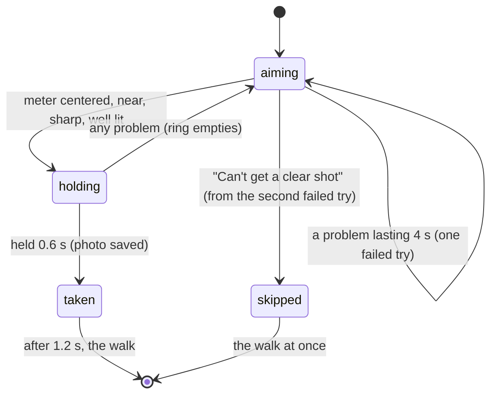

# The meter close-up

## Summary

The meter close-up takes one clear photo of the electric meter, so an installer can read it
later. The homeowner does not press a shutter: they hold the meter inside a circle and the phone
takes the photo itself once the meter is centered, near, sharp and well lit. It is the screen
right after the meter tap on [finding the meter](find-meter.md) (screen name `meterCloseUp`),
and it ends on its own. A homeowner who cannot get a usable photo can skip it after the second
failed try.

## The simple case

The circle appears in the middle of the camera view and the instruction reads "Hold your meter in
the circle", with "Your phone takes the photo by itself." The homeowner points the phone at the
meter from within about 1.5 m. While everything is right the circle's ring fills; after 0.6 s of
holding still it is full, the camera image flashes white under the words, a check mark appears in the circle and the
photo shrinks into the counter at the top right. About 1.2 s later the walk begins
([the wall walk](wall-walk.md)).

## The interaction, event by event

### Arriving

The circle scales in and fades up around the middle of the screen. The ring is empty, the
failed-try count is zero and nothing is saved. The meter's position comes from the tap that
opened this screen; the close-up checks where that point appears in each camera frame.

### Leaving at once

There is no way off this screen before the second failed try other than taking the photo. No
back button, no skip. Nothing is recorded until the photo is taken.

### First capture

The ring starts filling on the first frame where all of these hold: tracking is normal; the meter
appears within the middle half of the image in both directions; the phone is within 1.5 m of it;
the image is not too dark (mean brightness at least 40 of 255) or glaring (mean above 225, or
more than a fifth of the pixels clipped); and the frame is at least half as sharp as the last 15.
While a check fails, one short fix shows under the instruction, first failing check first:

| Problem | Shown |
| --- | --- |
| Tracking not normal | "Move slowly" |
| Meter outside the middle of the view, or behind the phone | "Center the meter in the circle" |
| Farther than 1.5 m | "Move closer to the meter" |
| Too dark | "Too dark to read. Try your phone's flashlight." |
| Too bright or glaring | "Too much glare. Tilt the phone a little." |
| Blurry | "Hold still" |

### While capturing

The ring fills over 0.6 s while every check passes; any failing frame empties it and the hold
starts again. A problem that lasts 4 s without a break counts as one failed try. From the second
failed try on, a button "Can't get a clear shot" appears below the fix. VoiceOver reads the circle
as "Photo of your meter" with its progress ("40 percent ready").

### Advancing

When the ring is full the photo is saved as the scan's meter close-up. If saving fails, that
counts as a failed try and the fix reads "Hold still". Otherwise the screen flashes, the check
mark appears, the counter goes up with a light haptic tap, and 1.2 s later the walk begins.
"Can't get a clear shot" goes straight to the walk without a photo; the scan then carries no
meter close-up and an installer reads the meter instead.

## Modifiers

| Modifier | At arrival | While capturing |
| --- | --- | --- |
| Live camera or replay | A replay plays its recording from the start through this screen; it only succeeds if the recording shows the meter. | No effect. |
| Autopilot | The autopilot waits 4 s for the photo, then presses "Can't get a clear shot" itself, whether or not the button is showing. | No effect. |
| Server or sample result | No effect. | No effect. |
| Larger text sizes | The fix and the button grow; the circle does not. | No effect. |
| Reduce Motion | The circle fades in over 0.15 s instead of scaling. | The flash still shows; the photo does not fly into the counter. |

## Cancel and interrupt

| Event | Before the second failed try | From the second failed try |
| --- | --- | --- |
| The screen's own way out | None. | "Can't get a clear shot": the walk starts without a close-up. |
| Start over | Not offered. | Not offered. |
| Tracking limited | "Move slowly"; the ring empties and a 4 s problem counts as a failed try. | Same. |
| Tracking lost or relocalizing | Coaching replaces the instruction; the ring stays empty. After 20 s the scan returns to finding the meter. | Same. |
| App backgrounded or a call | The screen stays; the ring restarts when the camera resumes. | Same. |
| Camera off or session failed | Suspected dead end ([the flow](../foundations/flow.md#open-questions-and-verification)). | Same. |
| Network lost or upload failing | No effect. | No effect. |
| App killed | The scan is lost. | The scan is lost. |

## Interactions with other systems

**Coverage and evidence.** The close-up is not a walk photo and covers no cells. **Stored
photos.** Saved as the scan's meter close-up and uploaded with it. The walk shows it again
while the phone is finding its place ([the wall walk](wall-walk.md#while-capturing)). **Upload and offline.** No
effect here. **Accessibility.** The circle is one element with a spoken progress value; the fix
appears as a label; the button carries the hint "Skips the close-up. An installer will read the
meter instead." **Haptics and motion.** A success haptic as the screen opens (the meter is
set) and a light tap when the photo is taken. **Verification hooks.** The log records "close-up skipped after N
failed attempts" when the homeowner skips.

## Edge cases

- The circle is fixed in the middle of the screen, but the check uses the middle half of the
  camera image. On a tall screen these differ: the meter can sit inside the circle and still be
  "not centered", or outside it and pass.
- Two meters side by side: only the tapped one is checked.
- Saving can fail after the ring fills; that is the only failed try that is not 4 s long.

## Open questions and verification

- **Suspected bug: the way out can fail to appear.** A failed try counts only when one problem
  lasts 4 s without a single good frame (`HouseScanKit/.../CloseUpGate.swift`, `evaluate`), while
  the hold needs 0.6 s of good frames in a row. A homeowner whose frames alternate between good
  and blurry (a shaky hand, flickering light) never fills the ring and never reaches a failed try,
  so "Can't get a clear shot" never appears. That is the dead end the first-try note rules out.
  Suggested rule: count attempts by elapsed time on the screen without a photo.
- The autopilot skips after 4 s by calling the skip action directly
  (`Runtime/Autopilot.swift`), so S3's full-flow UI test cannot catch the dead end above.
- Observed in the Simulator on the ADVIO replay (no meter in it): the screen showed for 4 s and the
  app logged "close-up skipped after 2 failed attempts". Its instruction card rendered without
  its text in that screenshot; see [verification](../verification.md).
- The circle-versus-image mismatch above is read from code; it needs a device to confirm.

Verified against house-scanning commit `a39d0a5` (t3/ios-mvf).
