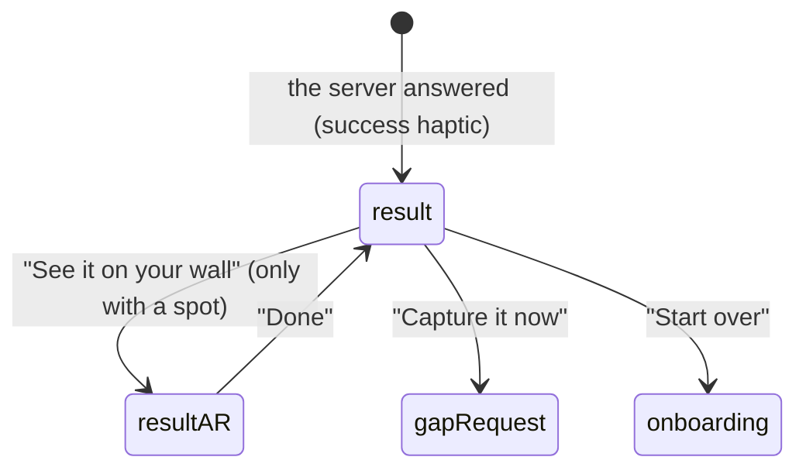

# The result

## Summary

The result is the server's answer, shown once the [upload](uploading.md) has finished. It covers
two screens. The result screen (screen name `result`) has a small 3D model of the homeowner's own
wall with the battery on it, a headline, where the battery goes and how much cable it needs, and
each check with its outcome. From there the homeowner can open the AR view (screen name
`resultAR`), which draws the battery onto the live camera at the chosen spot. They can also fill
in a missing view with "Capture it now", or begin again with "Start over". Nothing is captured on
either screen, and there is no way back to the walk.

## The simple case

After "Checking your wall" the result fades in with a success haptic. At the top, a 3D model of
the wall turns once and comes to rest on the battery, with the cable run from the meter and the
ground in front of each stretch tinted by outcome. Below it the headline reads "There's a spot for
your battery" and, in blue, where it is, for example "4 ft 3 in right of your meter, 3 ft of cable". Next come
the server's one-sentence summary, then "See it on your wall". Under that are a note that the
electrical panel still needs an electrician's review and "What we checked", one row per check, and the "Start over" button. The homeowner taps "See it on your wall", points the
phone at the wall and sees the battery standing there, then taps "Done" to go back.

## The interaction, event by event

### Arriving

The result screen opens only after the server has answered ([the flow](../foundations/flow.md)).
A success haptic plays, except when coming back from the AR view. The 3D model fills the top
340 points of the screen; the rest scrolls beneath it, in this order:

1. The headline, with an icon in the decision's color:

   | Decision | Headline |
   | --- | --- |
   | pass | "There's a spot for your battery" |
   | manual review | "An installer will take a look" |
   | reject | "This wall doesn't have a spot" |

2. The placement line, only when the server chose a spot: the spot's middle measured
   along the wall ("4 ft 3 in right of your meter", or "At your meter" within 3 in of it), then
   the cable length in whole feet ("3 ft of cable"). The server never sends a spot with a reject.
3. The server's summary sentence. If the summary is empty on a reject, the reason of the first
   failing check stands in.
4. "See it on your wall", only when there is a spot.
5. "The placement rules aren't final yet, so an installer reviews every result for now.", when
   the server's rules are not approved for automatic decisions.
6. "A closer spot may exist on the left of your meter. The scan didn't reach that side." (or
   right). It shows when the server asks for a view past a wall end, or when either wall end is
   an unexplored end that the server does not mark as beyond cable reach.
7. "Your electrical panel still needs an electrician's review. This scan only covers where the
   battery can go.", on every result: the server's answer covers where the battery goes, not the
   panel.
8. "What we checked", one row per check, in the server's order (see
   [While capturing](#while-capturing)).
9. "Still needed", one card per missing view the server lists (see [Advancing](#advancing)).
10. "Start over".

The headline block fades in and rises 12 points after 0.35 s. The 3D model sweeps over 1.6 s from
a high three-quarter view down to its resting angle, centered on the battery (or on the meter
when there is no spot).

### Leaving at once

"Start over" is always at the bottom. It forgets the wall, photos, marks and result and returns
to the introduction ([the flow](../foundations/flow.md#cancel-and-interrupt)). It asks for no
confirmation. The screen has no back button to the walk or the marks.

### First capture

Nothing is captured here. The first thing most homeowners do is turn the model or open the AR
view.

**The 3D model.** Dragging turns it, up to 70° either side and between 8° and 45° above the
ground; the first drag stops the opening sweep where it is. Pinching zooms between 0.6 and 1.6
times. The model shows the wall (to the marked wall ends, or 1.5 m past everything the result
mentions), the meter, every marked feature, the cable as a blue tube, and the battery as a white
box with a blue light bar. The server also sends its sweep: the stretches of wall where it tried
the battery, each with one outcome. The server gives each stretch as the range of places the
battery's left edge can start; the app extends it by the chosen battery's width so the tint
covers the wall the battery would stand on (without a chosen spot it covers the starts alone).
Each stretch is a translucent tint on the ground in front of the wall, as deep as the battery: green where a battery passes, amber where it is unsure, red
where it fails.

**The AR view.** "See it on your wall" crossfades to the camera. The instruction reads "Your
battery could go here" for an approved pass and "The spot an installer will check" otherwise,
with the placement line under it. With the sample result it reads "Example spot, not your
result", with "No server checked this scan." and the placement line. On the camera image the app draws each
sweep stretch as a tinted ground strip with a dashed outline, the cable as a blue line edged in
white, and the battery as a box with a soft shadow and a blue light bar across its front. The box
rises out of the ground as the view opens. Everything is placed relative to the meter's anchor,
so it stays on the wall as the homeowner moves. "Done" is the only control. The drawing is shown
only while tracking is normal (see [While capturing](#while-capturing)).

### While capturing

Each row of "What we checked" shows an icon (check, question mark or cross), the check's name
from the server, its reason, and a measurement line when the server measured something:
"Measured 3 ft 1 in. The rule is 3 ft, and the measurement can be off by about 4 in." The second
sentence drops its error clause when the server gives no error, and disappears when there is no
rule value. An unsure row adds one note: "An installer will check this" when the doubt is a
narrow margin, an unknown attribute, a rule that always needs review or no stated cause, or "One
more photo would settle this" when the area was not seen. The rows have no buttons of their own.

On the AR view the drawing is redrawn from every camera frame. Whenever tracking is not normal
(limited, lost or relocalizing), the drawing disappears at once and the instruction reads "Point
at your meter", with "The battery comes back once your phone finds its place." When tracking is
normal again the drawing returns, without rising again, and the instruction goes back to the
headline above.
No other coaching appears here: the homeowner is not told why tracking is limited.

### Advancing

"Done" returns to the result screen. The screen is built again, so the headline fades in again
and the model replays its sweep and loses any turn or zoom.

Each "Still needed" card shows the server's message. Under it is "Capture it now" when the phone
can build a request from it (a wall or ground view with its stretch, or a view past a wall end
with its side), and "An installer will check this" otherwise.
"Capture it now" opens a [gap request](gap-request.md) for that stretch, using the server's
message as the second line. For a view past a wall end, that end is forgotten first, because the
wall may go on. When the view is taken, or the homeowner taps "I can't get there", the scan is
uploaded again and a new result replaces this one. The old result cannot be reopened meanwhile.

## Modifiers

| Modifier | At arrival | While capturing |
| --- | --- | --- |
| Live camera or replay | A replay shows the "Replay" badge over the model. The AR view on a replay shows one still: the recorded frame that best shows the spot, with the battery drawn on it. | On a replay the AR picture does not move. Live, the drawing follows the phone. |
| Autopilot | The autopilot waits `-autopilotHold` seconds, opens the AR view itself (even when the result has no spot), waits again, taps "Done" and logs "AUTOPILOT done". | No effect. |
| Server or sample result | The sample result shows "Sample result, not from the server" over the model. It is always the same: "An installer will take a look", "4 ft 3 in right of your meter, 3 ft of cable", the rules note, the left-side note, the panel note, four checks and two "Capture it now" cards. The AR view says "Example spot, not your result", with "No server checked this scan." | "Capture it now" works, but the upload returns the same sample, so nothing changes. |
| Larger text sizes | The headline, notes and rows wrap and the page scrolls; the model stays 340 points tall. On the AR view the instruction grows, and at the largest sizes the chrome scrolls. | No effect. |
| Reduce Motion | The headline fades in over 0.2 s without rising. The model starts at its resting angle with no sweep. The AR battery rises over 0.2 s instead of springing up. | Dragging and pinching the model work as usual. |

## Cancel and interrupt

| Event | On the result | On the AR view |
| --- | --- | --- |
| The screen's own way out | "Start over"; "Capture it now" leaves for a gap request. | "Done", back to the result. |
| Start over | Offered at the bottom; see [the flow](../foundations/flow.md#cancel-and-interrupt). | Not offered. |
| Tracking limited | Nothing shown; the camera is hidden but keeps tracking. | The drawing disappears and the instruction reads "Point at your meter" with "The battery comes back once your phone finds its place." until tracking is normal. |
| Tracking lost or relocalizing | Nothing shown; the result stays however long the phone takes (fixed in `beede15`; it used to reset to finding the meter after 20 s). | The drawing disappears and "Point at your meter" shows, as above, until the phone finds its place. No reset. |
| App backgrounded or a call | The screen stays. When the app returns the phone relocalizes in the background; nothing is lost. | Same, with the camera resuming behind the drawing. |
| Camera off or session failed | No visible effect. | Suspected dead end, as in [the flow](../foundations/flow.md#open-questions-and-verification): no message, no picture. |
| Network lost or upload failing | No effect; the result is already on the phone. "Capture it now" leads to a new upload, which needs the network ([the upload](uploading.md)). | No effect. |
| App killed | The result is lost; nothing reopens it. | The result is lost. |

## Interactions with other systems

**Coverage and evidence.** Nothing here adds coverage; "Capture it now" hands over to a gap
request, which follows [coverage and guidance](../foundations/coverage-and-guidance.md).
**Stored photos.** No photos are kept on either screen. **Upload and offline.** The result needs
no network once shown; only "Capture it now" leads to another upload. **Accessibility.** The
headline block is read as one heading. The model is one element, "3D view of your wall", with a
value such as "Battery 3 ft right of your meter, cable 3 ft" and the hint "Drag to turn the view".
Each check row reads as "Distance from the window: Not sure yet", followed by its reason,
measurement line and note. The outcome words are "Looks good", "Not sure yet" and "Doesn't work".
The AR drawing is hidden from VoiceOver. **Haptics and motion.** A success haptic when the result
appears, not when returning from the AR view. **Verification hooks.** `STATE=result` and
`STATE=resultAR`. Identifiers: `result.headline`, `result.placement`, `result.rulesNotFinal`,
`result.unseenSide`, `result.panelReview`, `result.sampleBadge`, `check.<id>`, `action.showAR`,
`action.captureMissing`, `action.startOver`, `action.closeAR`.

## Edge cases

- A manual review can come without a spot. The headline then reads "An installer will take a
  look", with no placement line and no "See it on your wall".
- On a reject the checks are those of the nearest spot the server considered, and the model
  centers on the meter.
- The left-or-right note says "A closer spot may exist" even on a reject, where no spot was found.
- Opened without a spot (only the autopilot can do this), the AR view draws the sweep and says
  "Point at your meter", with no second line while tracking is normal.
- The AR battery is drawn over everything in the picture, including a bush or a person standing
  in front of the spot.
- With the sample result on a real phone, the AR view places a battery 4 ft 3 in right of the
  real meter, whatever the wall is like, under "Example spot, not your result".
- A "Still needed" item about the wall or the ground that comes without a stretch still shows
  "Capture it now", but the button does nothing.

## Open questions and verification

- The 20 s relocalization reset no longer applies on the result or the AR view
  (`Runtime/ScanEngine.swift:472-476`), fixed in `beede15`.
- The tinted stretches now reach one battery width past the last start
  (`Runtime/ScanEngine+Export.swift:132-141`; `start_ft` at `HouseScanKit/.../PlacementResult.swift:450`),
  fixed in `beede15`. A result with no spot still tints only the starts, which understates each
  stretch; the code says so.
- The AR view now names a sample spot as an example (`UI/Screens/ResultARScreen.swift:49-51`),
  fixed in `525ea40`. It still has no badge like the result screen's
  (`UI/Screens/ResultScreen.swift:96-105`).
- **Question: an end answered "It turns a corner" may read as unseen.** The left-or-right note
  shows when the server reports an end as unexplored and not beyond cable reach
  (`Runtime/ScanEngine+Export.swift:157-163`),
  and a corner answer is sent as unexplored. A homeowner who walked to the corner would then read
  that "the scan didn't reach that side". Depends on what the server echoes back; not checked.
- The measurement line says "The rule is 20 ft" for a limit that is a maximum and "The rule is
  3 ft" for a minimum. The app decodes the server's `comparison` but never shows it, and ignores
  `review_threshold_ft` (`UI/Copy/ScanCopy.swift:233-237`).
- "Capture it now" is offered only when the phone can build a request from the item
  (`Runtime/ScanEngine+Export.swift:152`), fixed in `beede15`; before, it could do nothing.
- After "Capture it now" the old result is gone from view. If the new upload fails, the homeowner
  has only "Try again" on the upload screen and cannot reread the earlier answer.
- VoiceOver reads the model's value and the measurement lines with "ft" and "in", which it reads
  as letters (`UI/Result/ResultScene3D.swift:296-321`, `UI/Screens/ResultScreen.swift:240`);
  `Distance.spoken` exists for this.
- The autopilot opens the AR view without checking for a spot (`Runtime/Autopilot.swift:93`), a
  path no homeowner can take.
- Dragging the model sits inside a scrolling page; whether a vertical drag turns the model or
  scrolls the page needs a device.
- Both screens were seen at `0876e03`, `24af434` and `525ea40` with the real server's answer, and with the sample result
  ([verification](../verification.md), RES-01 to AR-01). Whether the AR drawing lines up with a
  real wall, and hiding it while the phone relocalizes, need the live camera.

Verified against house-scanning commit `a39d0a5` (t3/ios-mvf).
