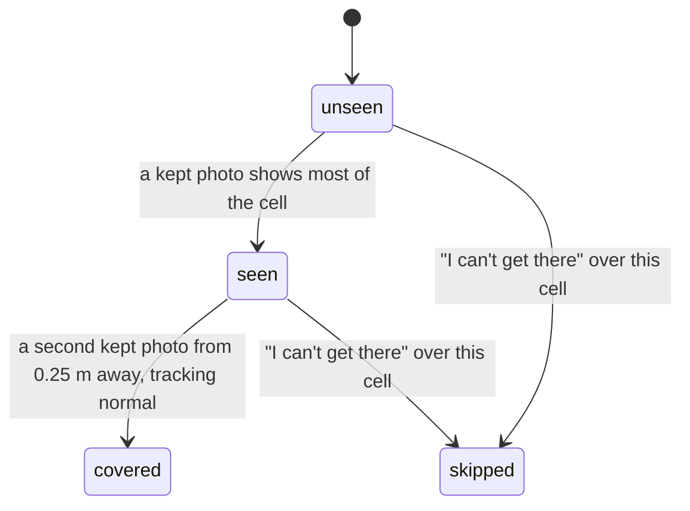

# Coverage and guidance

## Summary

While the homeowner walks, the app decides three things without being asked: which camera frames
to keep as photos, which stretches of wall and ground those photos have covered, and the one
thing the homeowner should do next. This document owns the rules and numbers behind all three.
The screens that use them, [the wall walk](../screens/wall-walk.md) and
[a gap request](../screens/gap-request.md), link here instead of restating them. None of it
decides whether a battery fits; covered means evidence exists, not that a spot passes.

## The simple case

The homeowner walks slowly along the wall with the phone pointed at it. Every half meter or so
the phone keeps a photo; the counter at the top goes up and the fog over the wall clears where
the camera has looked. The strip at the bottom fills in: gray where nothing has been seen, then
covered once a stretch has been seen from two places. The instruction at the top says where to
go ("Walk slowly to your left") and changes only when that is done or after at least 3 s.

## The interaction, event by event

The states are those of one 6 in cell of the [coverage strip](../glossary.md#seeing-the-wall).

### Arriving

Coverage starts empty when the meter is tapped: the strip is centered on the meter, both bands
gray. Nothing is kept on [finding the meter](../screens/find-meter.md) or during the
[close-up](../screens/meter-close-up.md), apart from the close-up itself.

### Leaving at once

A cell that no kept photo shows stays unseen for the rest of the scan. Nothing decays: a covered
cell stays covered.

### First capture

#### When a photo is kept

A frame is kept only when all of these hold:

- tracking has been normal for at least 0.5 s;
- the phone moves slower than 1.5 m/s and turns slower than 60° per second;
- the frame is at least half as sharp as the recent frames, not too dark (mean brightness at
  least 40 of 255) and not glaring (under a quarter of the pixels clipped);
- at least 0.33 s has passed since the last kept photo (at most about three per second);
- the phone has moved 0.5 m or turned 15° since the last kept photo, or the frame would show at
  least three cells nobody has seen yet.

A kept photo increments the counter and gives a light haptic tap.

### While capturing

A cell counts as **seen** when a kept photo shows most of it (60 % of its sample points) from no
farther than 6 m and no more than 65° from straight on, away from the outer 3 % of the image. It
becomes **covered** when a second kept photo, taken from at least 0.25 m away from the first,
also sees it. Photos are kept only with normal tracking, so every kept photo counts.

The strip shows what has been seen plus 2.5 m of fog ahead on each side, and stops at a marked
wall end.

#### One instruction at a time

The instruction is chosen in this order, first match wins:

1. **Coaching** from the camera, which replaces everything else until it clears: "Move your phone
   slowly" (starting up), "Slow down a little", "Aim at something with more detail", "It's too dark
   to see the wall", "Hold steady" (the last frame was blurry or moving), "Point at your meter
   again" (relocalizing), "Your phone lost its place".
2. **"Take a step back"** when the phone is closer than 1.2 m to the wall; satisfied at 1.4 m.
3. **Aim at a lagging band**: within 1 m either side of the phone, if one band is done over at least
   0.45 m (three cells) where the other is not, "Tilt down to show the ground" or "Tilt up to show
   more wall", with a ring on the spot.
4. **Walk to the left**, until coverage runs unbroken 6.1 m (20 ft) from the meter on the left;
   then **"Is this the left end of the wall?"**. Only after the left end is set: the same for the
   right.
5. With both ends set, the first stretch of at least 0.45 m between them where a band is not done
   (ground checked before wall), as an aim instruction.
6. **"That's the whole wall"**, with "Tap Done when you're ready".

A new instruction replaces the current one only when the current one is satisfied or has been up
for 3 s. An aim instruction is satisfied at 80 % of the cells within 0.3 m of its spot covered; a
walk instruction when that side's end is set.

### Advancing

Coverage is sent with the scan: covered cells as observed stretches of each band, skipped cells
and the kind of each end (real or unexplored). The server treats anything not observed as unknown.

## Modifiers

| Modifier | At arrival | While capturing |
| --- | --- | --- |
| Live camera or replay | No effect on the rules; a replay's frames go through the same checks. | Same. |
| Autopilot | No effect on the rules. | The replay runs at three times speed, so the time-based limits (0.33 s between photos, 3 s per instruction) bite more often. |
| Server or sample result | No effect. | No effect. |
| Larger text sizes | No effect on coverage. | No effect. |
| Reduce Motion | The fog still fades as cells clear, without drifting. | Same. |

## Cancel and interrupt

| Event | Before the first kept photo | After it |
| --- | --- | --- |
| The screen's own way out | "I can't get there" marks the cells the instruction asks for as skipped; see the screens. | Same. |
| Start over | Coverage is discarded. | Coverage and photos are discarded. |
| Tracking limited | No photo is kept until tracking has been normal for 0.5 s. | No photo is kept, so coverage stops growing until tracking is normal again for 0.5 s. |
| Tracking lost or relocalizing | Guidance waits behind the coaching. | After 20 s without relocalizing, coverage and photos are discarded and the scan returns to finding the meter. |
| App backgrounded or a call | No effect on coverage. | Coverage is kept. |
| Camera off or session failed | No photos can be kept. | Coverage so far is kept but cannot grow. |
| Network lost or upload failing | No effect. | No effect. |
| App killed | Coverage is lost. | Coverage is lost. |

## Interactions with other systems

**Coverage and evidence.** This document. **Stored photos.** Each kept photo is written as it is
kept; see [the flow](flow.md#interactions-with-other-systems). **Upload and offline.** Coverage
travels in the uploaded scene. **Accessibility.** The strip reads to VoiceOver as "Map of the
wall"; whether it also says how much is covered is checked on [the wall walk](../screens/wall-walk.md).
**Haptics and motion.** A light tap per kept photo; the fog fades where cells clear. **Verification
hooks.** Each instruction change logs `GUIDANCE=<name>`.

## Edge cases

- Walking faster than 1.5 m/s keeps no photos at all, with only "Hold steady" or no coaching.
- A stretch closer than 0.45 m to a covered stretch on both sides is never asked for.
- A walk that reaches 20 ft on the left asks for the left end whether or not the wall ends there.
- Coverage is on the one wall set by the meter tap; wall past a corner never becomes covered.
- Something standing between the phone and the wall (a bush, a bin) does not stop a cell counting
  as seen: coverage records where the camera looked, not what it could see. The server re-checks
  from the photos (`HouseScanKit/.../CoverageMap.swift:51`).

## Open questions and verification

- **Possible bug: no truthful answer at 20 ft.** At 6.1 m the walk asks "Is this the left end of the
  wall?" whether or not the wall continues. The only answers are "Wall ends here" (a real end) and
  "I can't get there" (an unexplored end). A homeowner whose wall simply continues has neither;
  choosing "Wall ends here" records a real end, which lets the server reject the site
  (`HouseScanKit/.../GuidancePlanner.swift:103`).
- The walk always sends the homeowner left first. Starting at the right end of a wall means walking
  past everything to the left first.
- "About N ft to go" can never appear: the engine always passes no remaining distance
  (`Runtime/ScanEngine.swift`, `step(_:)`).
- All thresholds are the code's stated hypotheses (research note), not measured values.

Verified against house-scanning commit `21a63e7`.
