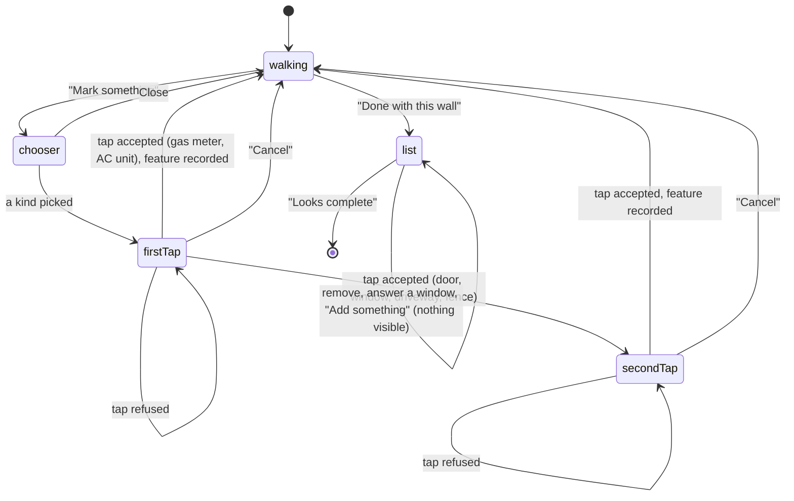

# Marking features

## Summary

Some things near the meter change where a battery can go: a gas meter, a door, a window, an AC
unit, a driveway, a fence. The camera does not find them; the homeowner marks each one by tapping
it on the camera image during [the wall walk](wall-walk.md). After "Done with this wall" the
list screen (screen name `markFeatures`) shows every feature marked, lets the homeowner remove one
and answer "Does this window open?" for each window, and ends with "Looks complete". This
document covers that screen and the marking interaction. Where a battery may go is decided by the
server from these marks; the phone only records them.

## The simple case

On the walk the homeowner sees a window and taps "Mark something". A chooser headed "What do you
see?" offers six kinds; they tap "Window". The chooser closes, a circle appears in the middle of
the camera image and the instruction reads "Tap the window's bottom-left corner", with "Put the
circle on it and tap Mark, or tap it on screen." They tap the corner on screen; a ring blooms
where the finger landed and the instruction becomes "Now tap its top-right corner". The second tap
records the window: a dashed outline appears on the wall, a pin at each tap, a window icon on the
coverage strip, and the phone gives a firm tap. When the walk is done they tap "Done with this
wall". The camera dims and a panel appears along the bottom: "Anything else near your
meter?", a row "Window", "About 4 ft right of your meter", then "Does this window open?" with
"It opens" and "It stays shut". They tap "It opens", then "Looks complete".

## The interaction, event by event

`walking` to `list` is the walk ending; the rest of the walk is in [the wall walk](wall-walk.md).

### Arriving

Marking starts from "Mark something" on the walk, shown next to "Wall ends here" or "Done with
this wall" when those are offered, and alone otherwise. It opens the chooser "What do you see?":
"Gas meter", "Door", "Window", "AC unit", "Driveway", "Fence", three to a row, with a close
button. Picking one closes the chooser and starts marking that kind. While marking, a circle sits
in the middle of the camera image, the dotted path and the target ring disappear, the instruction
shows the marking prompt, and the controls become "Cancel" and "Mark".

The list screen arrives when "Done with this wall" is tapped with both wall ends set (it is not
offered while a mark is in progress). The camera stays on screen, darkened, with a light panel
along the bottom: the title "Anything else near your meter?", the line "Gas meters, doors, windows, AC units,
driveways and fences all change where a battery can go.", then one row per feature in the order
marked, or "Nothing marked yet." if there are none. Each row shows the kind's icon, its name and
where it is ("About 4 ft right of your meter", or "Around your meter" when it spans the meter or
its middle is within 0.3 m of it), and a trash button. A window row adds "Does this window open?"
with two full-width answers stacked one above the other, "It opens" and "It stays shut", neither
selected. Below the list, "Add something" offers the six kinds as
buttons, and "Looks complete" stays pinned at the bottom of the panel. There is no instruction
card, no photo counter and no coverage strip on this screen, and no pins on the camera image.

### Leaving at once

While marking, "Cancel" forgets the taps so far and returns to the walk; nothing is recorded. The
chooser's close button returns to the walk without starting.

On the list, "Looks complete" is the only way on. It needs nothing: an empty list and unanswered
windows are both accepted. There is no way back to the walk ([the flow](../foundations/flow.md#edge-cases)).

### First capture

A tap counts when it lands on the open camera image (not on a card or button), or when "Mark" is
tapped, which uses the center of the circle. Each tap is checked in this order; the first failure
is a refusal:

| Check | Refusal shown |
| --- | --- |
| Tracking not normal | "One moment, your phone is still finding its place." |
| The phone is on the far side of the wall's line | "That spot is behind the wall. Tap something on this side." |
| The tap meets no surface: the wall's plane (gas meter, door, window, AC unit) or the ground (driveway, fence) | "Nothing to pin there. Aim at the wall or the ground and try again." |
| A ground tap more than 8 m out from the wall, or behind its line | "That's too far from the wall to matter. Tap something closer." |

A refusal replaces the instruction with its words in a warning style, keeps the prompt as the
second line, and gives a warning haptic. The step does not advance. The next accepted tap clears
it. What each kind asks for and records:

| Kind | Taps and prompts | What the mark records |
| --- | --- | --- |
| Gas meter, AC unit | One: "Tap the gas meter" / "Tap the ac unit", with "Put the circle on it and tap Mark, or tap it on screen." | The tapped point on the wall. The list and strip treat it as 0.3 m wide, centered on the tap; that width is nominal, not measured. |
| Door, window | Two: "Tap the door's bottom-left corner" (or "window's"), with the same second line; then "Now tap its top-right corner". | A rectangle on the wall: from the lower tap's height (never below the ground) to the higher, and between the two taps along the wall. Any two opposite corners give the same rectangle. |
| Driveway | Two: "Tap one end of the driveway's edge", with "Use the edge closest to the wall."; then "Now tap the other end of that edge". | The two ground points: one edge. |
| Fence | Two: "Tap the bottom of the fence at one end", with "Where it meets the ground."; then "Now tap the bottom at the other end". | The two ground points where the fence meets the ground. |

### While capturing

Between the taps of a two-tap mark only the ripple confirms the first tap; no pin appears until
the mark is complete. The walk carries on underneath: photos are still kept and coverage still
grows, but coaching, the "Can't get there" reply, the path and the target ring stay hidden until
the mark ends. A finished mark draws on the camera image (a dashed outline for a door or window, a
dashed line for a driveway or fence, a pin at every tap) and as its icon on the coverage strip.

On the list, the trash button removes its row at once, with no confirmation and no undo; the row
fades out. "It opens" or "It stays shut" fills in when chosen and can be changed; once one is chosen there is no
way back to unanswered. The "Add something" buttons do nothing the homeowner can see (see Open
questions).

### Advancing

A mark is recorded on its last accepted tap: the marking ends, the walk's controls return, and
the new feature is added to the end of the list. "Looks complete" runs the phone's own gap check
and goes to a [gap request](gap-request.md) or straight to [the upload](uploading.md) (see
[the flow](../foundations/flow.md#the-interaction-event-by-event)). The features are sent in the
scene description with the scan:

- a door or window as an opening with its span along the wall, bottom and top; for a window,
  whether it opens (yes for "It opens", no for "It stays shut", or left empty when unanswered); a door always left empty;
- a gas meter or AC unit as the tapped point;
- a fence as its two foot points, a driveway as its two edge points.

Heights are sent as height above the ground at the wall.

## Modifiers

| Modifier | At arrival | While capturing |
| --- | --- | --- |
| Live camera or replay | On the list, the live camera keeps running dimmed but keeps no photos; a replay stops on the frame it was showing. | On a replay a tap is measured against the recorded frame on screen. |
| Autopilot | On the walk the autopilot marks a gas meter and a window on covered wall, answers that the window opens, and on the list waits `-autopilotHold` seconds before pressing "Looks complete". It calls the actions directly, never the chooser or "Mark". A mode badge reads "Replay · Autopilot", in capitals. | If the window is still incomplete after two tries at its corners, it cancels it and logs the refusal. |
| Server or sample result | No effect. | No effect. |
| Larger text sizes | At accessibility sizes the chooser and the "Add something" buttons go to one column (from three and two), "Mark something" spans the width, and the panel scrolls with "Looks complete" still pinned. The window answers are stacked at every size. | No effect. |
| Reduce Motion | The screen crossfades in 0.15 s. Rows still fade and scale slightly as they appear and go. | The tap ripple fades without growing. |

## Cancel and interrupt

| Event | While a mark is in progress (on the walk) | On the list |
| --- | --- | --- |
| The screen's own way out | "Cancel": the taps so far are forgotten, nothing is recorded. | None; "Looks complete" is the only way on. |
| Start over | Not offered. | Not offered. |
| Tracking limited | Every tap is refused with "One moment, your phone is still finding its place."; the prompt hides the coaching. | Nothing is shown; the list is unaffected. |
| Tracking lost or relocalizing | Taps are refused as above. After 20 s the scan returns to finding the meter and every feature is forgotten, but the half-done mark is not (see Open questions). | No coaching is shown. After 20 s the scan returns to finding the meter and the list is gone, without warning (see Open questions). |
| App backgrounded or a call | The mark in progress and its taps are kept; taps are refused until tracking is normal again. | The list and answers are kept. |
| Camera off or session failed | Suspected dead end ([the flow](../foundations/flow.md#open-questions-and-verification)). A tap is measured against the last frame the camera delivered. | The list still works and "Looks complete" still leads on. |
| Network lost or upload failing | No effect. | No effect here; see [the upload](uploading.md). |
| App killed | The scan is lost. | The scan is lost. |

## Interactions with other systems

**Coverage and evidence.** A mark is a claim by the homeowner, not evidence: it keeps no photo and
covers no cell, and nothing checks that the marked stretch was ever seen. Photos keep being kept
during marking on the walk ([coverage and guidance](../foundations/coverage-and-guidance.md#when-a-photo-is-kept)).
**Stored photos.** None are taken for a mark. **Upload and offline.** Marking and the list need no
network; the features travel in the uploaded scene description. **Accessibility.** The title and
"Add something" are headings. A row reads as one element, its name then its place; the trash
button reads "Remove window"; the kind buttons read "Add window" on the list and "Mark window" in
the chooser; the chosen answer carries the selected trait. "Mark" has the
hint "Marks the point under the circle in the middle of the screen"; "Mark something" has "Pin a
gas meter, door, window, AC unit, driveway or fence". Tapping on the camera image is not
available to VoiceOver; "Mark" is the only way. **Haptics and motion.** A firm tap when a feature
is recorded, a warning when a tap is refused, nothing for a removal or an answer. A ring blooms
and fades at each tap in 0.55 s. **Verification hooks.** `STATE=markFeatures` when the list
appears; marking itself logs nothing. Identifiers: `action.markSomething`, `action.closeTray`,
`feature.<kind>` (in the chooser and on the list), `action.markPoint`, `action.cancelMarking`,
`action.deleteFeature`, `window.opens.yes`, `window.opens.no`, `action.confirmFeatures`.

## Edge cases

- Tapping the same refused spot again repeats the same refusal: the text does not change and the
  warning haptic does not fire again; only the ripple shows the tap was received.
- Two taps at the same height make a door or window with no height; nothing checks the size.
- Wall taps have no distance limit. A tap near the horizon can land far along the wall or high up
  it, and is recorded there. Only ground taps are limited, to 8 m out.
- A door or window on the wall around a corner is recorded where the tap meets this wall's plane,
  extended: at the wrong place.
- A feature marked beyond a wall end is still recorded and sent.
- Removing every row brings back "Nothing marked yet."
- Features cannot be edited after "Looks complete": not on a gap request, the upload or the result.

## Open questions and verification

- **Suspected bug: "Add something" does nothing visible.** The buttons start a mark
  (`UI/Screens/MarkFeaturesScreen.swift:64`, accepted on this screen by
  `Runtime/ScanEngine+Actions.swift:86`), but the list screen never shows the circle, the prompt,
  "Mark" or camera taps; those exist only on the walk (`UI/Screens/WallWalkScreen.swift:28-45,
  121-135`). The homeowner who spots a missed gas meter here presses a button and nothing
  happens. "Looks complete" does not end the stray mark either (`ScanEngine+Actions.swift:168-171`).
- **Suspected bug: "Tap the ac unit".** The prompt lowercases the kind's name
  (`UI/Copy/ScanCopy.swift:122`), so "AC unit" becomes "ac unit" on screen, and VoiceOver hears
  "Remove ac unit", "Add ac unit", "Mark ac unit" (`MarkFeaturesScreen.swift:121, 189`,
  `WallWalkScreen.swift:282`).
- **Suspected bug: the list can vanish without a word.** Relocalization is timed on every screen
  (`Runtime/ScanEngine.swift:195, 402-413`), but the list shows no coaching. After a call, a
  homeowner reading the list with the phone pointed away for 20 s is sent back to finding the
  meter with every mark and photo gone, never having seen "Point at the meter like this.".
- **Suspected bug: a half-done mark survives the 20 s reset.** `resetSpatialState` clears the
  features but not the mark in progress or its taps (`ScanEngine.swift:431-456`, taps held at
  `ScanEngine.swift:65`). After the meter is tapped again the walk opens mid-mark, and a first tap
  from the old, discarded map can be joined to a new one. The same holds for a stray mark from
  "Add something".
- **Wrong words for the wrong-side refusal.** The check is where the phone is, not where the tap
  lands (`ScanEngine+Actions.swift:101`). "Tap something on this side" cannot help; stepping back
  out in front of the wall's line does.
- The place in a row reads "ft" to VoiceOver (`MarkFeaturesScreen.swift:107`), though the app has
  a spelled-out form for this (`UI/Copy/Distance.swift:25`).
- Unverified: all marking needs the live camera or the autopilot, which bypasses the chooser and
  "Mark". MF-01 in [verification](../verification.md) was observed on an earlier commit and has
  not been rechecked here.

Verified against house-scanning commit `525ea40` (t3/ios-mvf).
