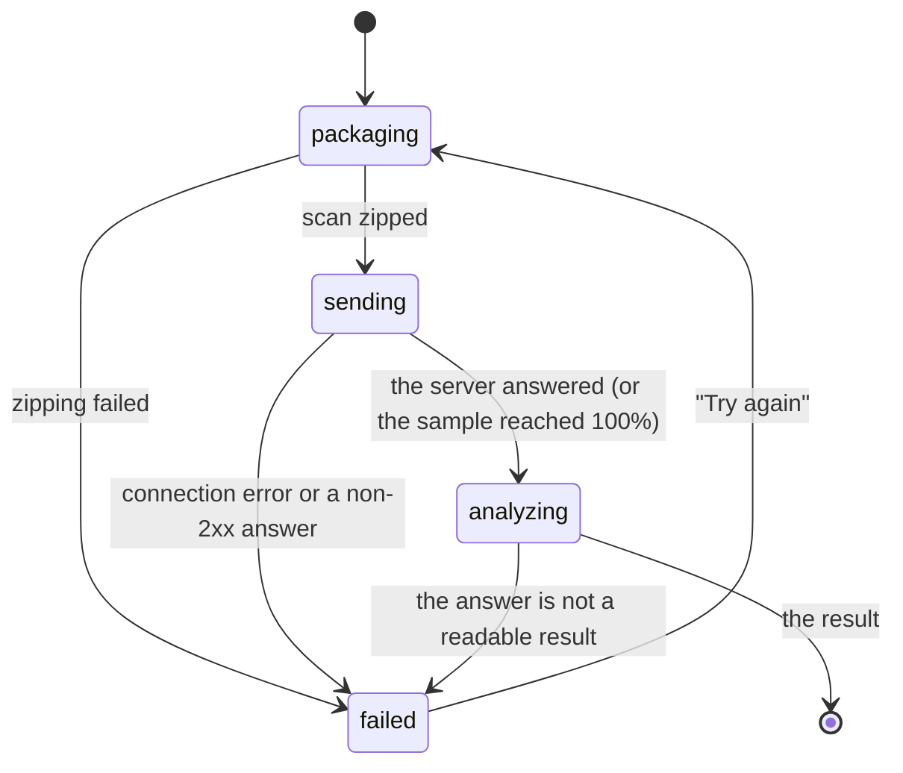

# The upload

## Summary

The upload screen (screen name `uploading`) sends the scan and waits for the result. The
homeowner does nothing here unless it fails. It shows a large symbol, a title and three steps
that tick off in order: "Get photos ready", "Send photos", "Check clearances". It appears after
"Looks complete" on [marking features](mark-features.md) when the phone finds no gap, or after a
[gap request](gap-request.md) is taken or skipped, and it ends on its own when the answer arrives
([the result](result.md)). If the upload fails, the steps give way to one button, "Try again".
There is no other way off the screen.

## The simple case

The camera closes and the screen reads "Getting your photos ready", with a spinner beside "Get
photos ready". A moment later the first step becomes "Photos ready" with a check mark and the
title changes to "Sending your photos", with "Keep the app open. It takes about a minute." The
second step counts up: "Sending photos, 40%". When the server's answer arrives the title briefly
becomes "Checking your wall" ("Measuring clearances around your meter."), and the result appears
with a success haptic.

## The interaction, event by event

### Arriving

The screen fades in over 0.25 s on a plain background; the camera view is gone. The symbol is a
stack of photos in a pale circle and pulses while work is going on. The title is "Getting your
photos ready" with no second line. Of the three steps, the first has a spinner and the other two
an empty circle in a muted color. The app first waits for photos still being written to finish,
for up to 10 s, then zips the scene description (`scene.json`) with the photos.

### Leaving at once

None. There is no Cancel, no back and no Start over on this screen. Until an answer or a
failure, the homeowner can only wait or close the app.

### First capture

Nothing is captured here. The first durable step is the zip: the scene description, every
[kept photo](../glossary.md#seeing-the-wall) of the scan and the [close-up](meter-close-up.md)
if one was taken. Once it is written the symbol becomes an upward arrow, the first step reads
"Photos ready" with a check mark, the title becomes "Sending your photos" and the second step
reads "Sending photos, 0%".

### While capturing

The percentage follows the bytes sent to the server, rounded to a whole number and capped at 99%
until the server answers. The digits roll as they change. When the answer arrives, the symbol
becomes a ruler, the second step reads "Photos sent", the third gets the spinner and the title
becomes "Checking your wall" with "Measuring clearances around your meter." With a real server
this lasts only as long as the app takes to read the answer (see Open questions).

Any failure replaces the three steps with a "Try again" button, stops the pulse and turns the
symbol to the caution color:

| What failed | Symbol | Title | Second line |
| --- | --- | --- | --- |
| Any connection error (no network, server unreachable, timeout) | Wi-Fi crossed out | "You're offline" | "Your scan is saved on this phone. Try again when you have signal." |
| The server answered with an error, the answer was unreadable, or zipping failed | Warning triangle | "That didn't go through" | The error's own text, for example "The server answered", the status code and the start of the server's reply |

"Try again" returns to "Getting your photos ready", zips the scan again and sends all of it.

### Advancing

When the answer is a readable result, the app stores it, the title becomes "Done" with a check
mark symbol, and the result screen appears with a success haptic
([the flow](../foundations/flow.md#interactions-with-other-systems)). In normal use the switch
is immediate, so "Done" is not seen. Nothing advances without an answer: a failure stays on
screen until "Try again" succeeds.

## Modifiers

| Modifier | At arrival | While capturing |
| --- | --- | --- |
| Live camera or replay | A replay stops playing; the scan is zipped the same way. | On the live camera the phone still watches tracking behind this screen (see Cancel and interrupt); a replay does not. |
| Autopilot | A badge at the top left reads "Replay · Autopilot" (in capitals). With the sample result, the `-autopilotHold` time replaces the 1.2 s in the timings below. | If no result arrives within 240 s and the upload has failed, the autopilot presses "Try again" once and waits 90 s more. With `-autopilotGate`, "Done" stays up until the test's gate file appears, at most 120 s. |
| Server or sample result | With `-serverURL` the zip is posted to that server. Without it, or with `-sampleResult`, the scan is still zipped but not sent. | The sample shows 25%, 50% and 75% about 0.24 s apart, then "Checking your wall" for 1.2 s, then the [sample result](../glossary.md#after-the-walk). It fails only if the sample file is missing from the app. |
| Larger text sizes | Title, second line and steps grow and wrap; the screen scrolls when they no longer fit. The symbol stays 132 pt. | No effect. |
| Reduce Motion | The screen fades in over 0.15 s; the symbol does not pulse. | Check marks still scale in and the symbol still swaps with an animation. |

## Cancel and interrupt

| Event | While zipping or sending | After a failure |
| --- | --- | --- |
| The screen's own way out | None. | "Try again": zips and sends the whole scan again. |
| Start over | Not offered. | Not offered. |
| Tracking limited | No effect; this screen shows no coaching. | No effect. |
| Tracking lost or relocalizing | Suspected bug: after 20 s of relocalizing on the live camera, the scan is forgotten and the app returns to finding the meter; the answer, when it comes, is dropped. | Same: the failure gives way to finding the meter. |
| App backgrounded or a call | The app asks for no background time, so iOS may suspend the transfer; a broken connection would then show "You're offline". Unverified. | The failure stays. |
| Camera off or session failed | No effect; the upload does not need the camera. | No effect. |
| Network lost or upload failing | The steps give way to the failure and "Try again" (table above). | "Try again" fails the same way until the network or server is back. |
| App killed | The scan is lost. The zip and photos stay in the cache, never reopened. | Same, although the screen said "Your scan is saved on this phone". |

## Interactions with other systems

**Coverage and evidence.** Nothing is captured here. The scene description carries the wall,
the covered stretches of each band, whether each wall end is a real end, the marked features,
and each kept photo's camera position and lens data
([coverage and guidance](../foundations/coverage-and-guidance.md)). The server evaluates the whole
scan again on every upload. **Stored photos.** The zip, `scan.zip`, is written into the scan's
cache folder ([the flow](../foundations/flow.md#interactions-with-other-systems)) and replaced on
each attempt. It holds `scene.json`, every kept photo as `k00001.jpg`, `k00002.jpg` and so on
(landscape JPEGs, unrotated, as the camera produced them) and the close-up as `meter_close.jpg`.
**Upload and offline.** The app posts the raw zip to `{serverURL}/v1/placements` with
`Content-Type: application/zip` and `Accept: application/json`. The request times out after
120 s without data. Any answer outside 200–299 is a failure; so is one that does not read as a
result: a schema version other than 1.0, a missing required field, a wrong type, a pair of the
wrong length, or a value outside a fixed set such as the decision or an outcome
(`HouseScanKit/.../PlacementResult.swift:1-11`). Fields the app does not know are ignored, so the server can add
optional ones without breaking the upload. Only connection errors count as offline. **Accessibility.** The title is a header. The
symbol is hidden from VoiceOver. The three steps are one element, read together. No change of
step or percentage is announced, and neither is a failure. **Haptics and motion.** None on
arrival, failure or "Try again"; a success haptic when the result appears. The symbol pulses while
working and swaps with a replace animation; check marks scale in; the title crossfades in 0.2 s.
**Verification hooks.** `STATE=uploading` on arrival. The log records "bundle <path> with N
keyframes" after zipping, and "packaging failed: …" or "upload failed: …" with the error. The
autopilot logs "upload failed; retrying once". Test identifiers: `screen.uploading`,
`upload.steps`, `action.retryUpload`.

## Edge cases

- The screen can appear more than once in a scan: after each gap request, including one started
  with "Capture it now" on the result. Each visit starts again at "Getting your photos ready" and
  sends every photo, not only the new ones.
- A photo whose write has not finished after the 10 s wait is left out of the zip without notice.
- After a relocalization reset earlier in the scan, only photos kept since the reset are sent;
  the older files stay in the folder.
- A wrong server URL, a stopped server or a slow server that goes quiet for 120 s all show "You're
  offline" and "Try again when you have signal", even with full signal.
- "Try again" does nothing once pressed until the attempt fails again; a second tap is ignored.

## Open questions and verification

- The wrong upload route ([bug triage](../bug-triage.md) B-01) is fixed in `0876e03`: the app
  posts to `/v1/placements` (`Runtime/ResultClient.swift:24`), and the server answered 200 in the
  Simulator run at this commit ([verification](../verification.md), FLOW-02).
- **Suspected bug: raw error text on screen.** The second line of "That didn't go through" is the
  error's developer description (`UI/Copy/ScanCopy.swift:177`, fed by
  `Runtime/ScanEngine.swift:533, 560`): HTTP status codes, server JSON, decoder errors. B-02.
- **Suspected bug: "You're offline" for any connection error.** `Runtime/ScanEngine.swift:560`
  treats every `URLError` as offline, including an unreachable host, refused connection and
  timeout. The copy then tells a homeowner with full signal to wait for signal.
- **Suspected bug: "Checking your wall" is skipped with a real server.** Progress is capped at
  99% while sending (`Runtime/ResultClient.swift:68`) and reaches 100% only after the server has
  answered (`:40`); the step changes only then (`Runtime/ScanEngine.swift:542, 546`). The
  homeowner watches "Sending photos, 99%" for the whole analysis, then the result replaces
  "Checking your wall" almost at once. Only the sample result shows the third step.
- **Suspected bug: a relocalization reset can wipe the scan during the upload.** The
  relocalization check runs on every live frame whatever the screen (`Runtime/ScanEngine.swift:189`,
  `364`). After 20 s it forgets the wall, marks and photo list and goes to `findMeter` (`:386–409`),
  and the upload's answer is dropped (the `generation` guards at `:545, 552`). A homeowner who
  locks the phone mid-upload and returns somewhere the phone can't recognise would lose the scan.
  Unverified: needs a device, and whether the AR session keeps delivering frames while the camera
  view is off screen is not settled by the code.
- The app asks for no background execution time (no `beginBackgroundTask`), so "Keep the app
  open" is the only guard for the transfer. What iOS does to the transfer when the phone locks
  has not been tested.
- "It takes about a minute" has no measurement behind it; no upload has been timed with a real
  scan.
- The comment on `writeBundle` (`Runtime/KeyframeStore.swift:83–84`) says the zip stays so a
  failed upload can be retried, but "Try again" rebuilds it (`Runtime/ScanEngine+Actions.swift:194–196`).
  Harmless, but the kept zip is never reused.
- Pass 1 (`21a63e7`) saw "That didn't go through" with no button or symbol visible
  ([verification](../verification.md) UP-01, B-05). Not rechecked at this commit.

Verified against house-scanning commit `0876e03` (t3/ios-mvf).
