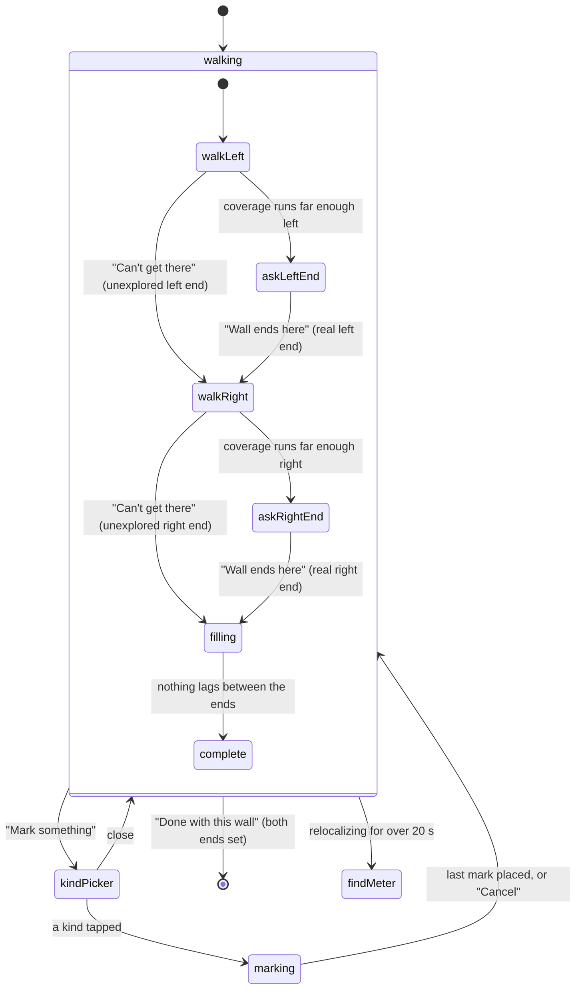

# The wall walk

## Summary

The wall walk is where the scan collects its evidence. The homeowner walks along the wall with
the phone pointed at it, first to the left of the meter and then to the right, and the phone keeps
photos by itself. Fog over the camera image clears where the phone has looked, the coverage strip
at the bottom fills in, and one instruction at the top says what to do next. The homeowner says
where the wall stops on each side ("Wall ends here", or "Can't get there" when they cannot go
further), can mark features on the way ("Mark something"), and leaves with "Done with this wall"
once both ends are set. It follows [the meter close-up](meter-close-up.md) (screen name
`wallWalk`) and leads to [marking features](mark-features.md). If the phone loses its place for
too long, the scan starts again from [finding the meter](find-meter.md).

## The simple case

The screen opens over the same camera view. The instruction reads "Walk slowly to your left", with
"Keep the wall and the ground in view." Blue dots on the ground show where to walk, and a ring on
the wall shows where to aim. The homeowner walks. The counter at the top right goes up, the fog
lifts off the wall and ground behind them, and the strip turns from gray to amber to green.

When enough of the left side is covered, the instruction asks "Is this the left end of the wall?"
and a "Wall ends here" button appears. The homeowner aims the middle of the screen at the corner
and taps it. A white line appears on the wall there, and the instruction switches to "Walk slowly
to your right". They walk back past the meter and do the same on the right. With both ends set,
"Done with this wall" appears; any stretch between the ends that is still thin gets one more aim
instruction, and then "That's the whole wall", with "Tap Done when you're ready." Tapping "Done with
this wall" opens the list of marks.

## The interaction, event by event

`filling` and `complete` both show "Done with this wall". "Take a step back" and the tilt
instructions can interrupt any walking state; they are left out of the diagram.

### Arriving

The camera stays open from the close-up; only the chrome changes. At the top: a mode badge on a
replay, the photo counter (it already counts the close-up, if one was taken), and the instruction
card. At the bottom: a "Mark something" button and the coverage strip. Over the camera image:
fog on the wall band and ground band around the meter, a dot on the meter, and the wayfinding
cues. The first instruction is chosen from the first camera frame, in the order set out in
[coverage and guidance](../foundations/coverage-and-guidance.md#one-instruction-at-a-time). A
homeowner who has just held the meter close is usually nearer the wall than the walk wants, so
the first line they read is likely "Take a step back", with "Your phone needs to see more of the
wall at once."

The instructions this screen can show, with their second lines:

| Instruction | Second line | Cue on the camera |
| --- | --- | --- |
| "Take a step back" | "Your phone needs to see more of the wall at once." | None. |
| "Tilt down to show the ground" | "The strip along the wall, 3 ft 4 in left of your meter." (the distance varies) | Ring on the ground, dots toward it. |
| "Tilt up to show more wall" | "Around 3 ft 4 in left of your meter." (the distance varies) | Ring on the wall, dots toward it. |
| "Walk slowly to your left" (or right) | "Keep the wall and the ground in view." | Ring on the wall past the covered stretch, dots toward it. |
| "Is this the left end of the wall?" (or right) | "Aim at the corner, or where something blocks your way, and tap Wall ends here." | Ring at the end of the covered stretch, no dots. |
| "That's the whole wall" | "Tap Done when you're ready." | None. |

A distance within 3 in of the meter reads "at your meter". Coaching replaces all of these while
the phone has a problem (see [Cancel and interrupt](#cancel-and-interrupt)).

The wayfinding cues work together. The **path** is a line of blue dots on the ground, 1.5 m out
from the wall, from where the homeowner stands toward the next place to stand; the dots shrink
with distance like paint on the ground. The **target** is a white-and-blue ring, sized to the
distance, that pulses slowly while its point is comfortably on screen. Near the edges or off
screen it becomes a blue chevron at the side of the screen, pointing toward the spot, kept clear
of the instruction card and the buttons.

### Leaving at once

There is no back button and no way to leave without setting both ends. The fastest way off is
"Can't get there" under "Walk slowly to your left" and again under "Walk slowly to your right":
each sets that side's end where coverage stops, which on arrival is the meter itself. The
instruction then reads "That's the whole wall" and "Done with this wall" moves on with no walk
photos at all (see [Open questions](#open-questions-and-verification)). The only other way off is
the phone losing its place for over 20 s, which throws the walk away.

### First capture

The first photo is kept by the rules in
[coverage and guidance](../foundations/coverage-and-guidance.md#when-a-photo-is-kept). When it is
saved, the counter's camera icon flashes green and the number rolls up by one. There is no haptic
tap for walk photos in this build. Wall and ground cells the photo shows most of go from fog to a
thinner haze: their fog fades over 0.7 s while drifting upward, like mist lifting. On the strip
those cells turn from gray to amber. A cell seen a second time from a different position turns
green on the strip and its haze clears completely.

### While capturing

**The strip.** A dark rounded panel above the bottom edge. The top row is the wall band, the lower,
thinner row the ground band. Cells are gray while unseen, amber once seen, green once covered, and
slate with a white slash when skipped. A blue line and a lightning-bolt badge mark the meter, a
white pointer under the strip marks where the homeowner stands, and small ticks along the bottom
mark every foot, longer every fifth. A marked end is a tall white cap; a marked feature shows its
icon above the rows. The strip always spans at least 3.5 m (about 11 ft), and its scale changes as
coverage, the ends or the homeowner move outward.

**The fog.** A frosted haze painted on the wall face (up to the top of the wall band) and on the
ground in front of it, over what has been seen plus the fog ahead of it on each side. Unseen cells are thick, seen cells
thinner, covered cells clear. Skipped cells are not fogged: they get a slate tint with white
diagonal hatching, so they read neither as clear nor as unseen. Set ends are white vertical lines
on the wall with a white dot at the foot.

**The instruction.** It changes only when the current one is satisfied or has been up long enough
([coverage and guidance](../foundations/coverage-and-guidance.md#one-instruction-at-a-time)). The
old line blurs out and the new one blurs in.

**"Can't get there".** A small pill inside the instruction card, under the text. It shows only
under "Walk slowly to your …", "Tilt down to show the ground" and "Tilt up to show more wall",
and never while coaching is showing, the kind picker is open or a mark is in progress.

- Under a tilt instruction it marks the cells not yet covered in a 1 m stretch centered on the
  spot as skipped, in that band only. The fog there turns to hatching, the strip shows slate, and
  the next instruction is chosen at once.
- Under a walk instruction it sets that side's end as an unexplored end, at the point where
  coverage stops running unbroken from the meter. The walk turns to the other side, or to the
  thin stretches between the ends.

**"Wall ends here".** Shown, with "Mark something" beside it, only while the instruction asks "Is
this the left end of the wall?" or the right one. Tapping it takes the point in the middle of the
screen, finds where it meets the wall's line, and sets a real end there. Which end it sets depends
on which side of the meter that point is, not on which end was asked for. The white end line
appears on the camera, the cap appears on the strip, and the instruction moves on. Nothing on the
screen marks the middle of the screen at this moment, and if the middle of the screen does not
meet the wall line (the phone aimed away from the wall) the tap does nothing.

**"Mark something".** Always available while walking. It replaces the buttons with the kind
picker: a panel headed "What do you see?", a close button, and six tiles, each an icon and a
name: "Gas meter", "Door", "Window", "AC unit", "Driveway", "Fence". While it is open,
"Can't get there" hides. The close button returns the buttons. Tapping a tile starts marking that
kind and closes the picker.

**Marking.** The ring and the path disappear, a white circle with a center dot appears in the
middle of the screen, and the bottom row becomes "Cancel" and "Mark". The instruction becomes the
marking prompt:

| Kind | First prompt | Second prompt |
| --- | --- | --- |
| Door, window | "Tap the door's bottom-left corner" (or window's), with "Put the circle on it and tap Mark, or tap it on screen." | "Now tap its top-right corner" |
| Driveway | "Tap one end of the driveway's edge", with "Use the edge closest to the wall." | "Now tap the other end of that edge" |
| Fence | "Tap the bottom of the fence at one end", with "Where it meets the ground." | "Now tap the bottom at the other end" |
| Gas meter, AC unit | "Tap the gas meter" (the AC unit prompt reads "Tap the ac unit"), with "Put the circle on it and tap Mark, or tap it on screen." | None: one mark. |

The homeowner can tap the spot on the camera image or put the circle on it and tap "Mark". Either
way a white ring blooms out from the tapped point (the middle of the screen for "Mark"). Doors,
windows, gas meters and AC units are placed on the wall face; driveways and fences on the ground.
A mark the app accepts moves the prompt on; the last one adds the feature, gives a firm haptic
tap, draws it on the camera (white dots on the marks, a dashed outline for a door or window, a
dashed line for a driveway or fence) and adds its icon to the strip. Marking then ends and the
walk buttons return.

A refused mark keeps the step. The instruction shows the reason with a red warning icon, the
prompt drops to the second line, and the phone gives a warning haptic:

| Refusal | When |
| --- | --- |
| "One moment, your phone is still finding its place." | Tracking is not normal. |
| "That spot is behind the wall. Tap something on this side." | The phone itself is on the far side of the wall line. |
| "Nothing to pin there. Aim at the wall or the ground and try again." | The tap's line of sight never meets the wall face (or the ground, for a driveway or fence). |
| "That's too far from the wall to matter. Tap something closer." | A driveway or fence mark lands more than 8 m out from the wall, or behind it. |

"Cancel" drops the marks placed so far for this feature and returns to walking. While marking,
the marking prompt takes the instruction slot even over coaching, and new photos keep being
taken if the homeowner moves.

**Finding its place again.** While tracking is not normal, the fog, path, ring, meter dot, ends
and marks fade off the camera image over 0.2 s and fade back once it is normal
([coverage and guidance](../foundations/coverage-and-guidance.md#one-instruction-at-a-time)).
While the phone is relocalizing, the instruction reads "Point at the meter like this.", with "Your
phone lost its place for a moment.", and the meter close-up taken at the start appears in the
middle of the screen: a square photo with rounded corners, a white border and a shadow, fading in
and out over 0.2 s. It cannot be tapped. If the close-up was skipped ("Can't get a clear shot") or its
thumbnail could not be read back, there is no photo and only the instruction shows.

### Advancing

"Done with this wall" appears once both ends are set, whatever the coverage between them. Tapping
it ends any marking and moves to [marking features](mark-features.md). What moves with it: the
coverage (covered, skipped and unseen cells), each end with its kind (real or unexplored), the
features marked so far and the walk photos. Coverage between the ends that was never covered
stays unseen; the server treats it as unknown
([coverage and guidance](../foundations/coverage-and-guidance.md#advancing)). There is no way back
to the walk from the next screen.

## Modifiers

| Modifier | At arrival | While capturing |
| --- | --- | --- |
| Live camera or replay | A replay starts playing its recording from the first frame (leaving out any frames the autopilot holds back for a gap request); the meter's wall comes from the recording. | When the recording ends the image freezes on its last frame and the instruction stops changing. The 20 s reset never happens on a replay. |
| Autopilot | The walk plays at three times speed and the badge reads "Replay · Autopilot". | After the recording ends, the autopilot marks a gas meter and a window by calling the marking actions at projected points, sets both ends (falling back to setting them directly when no frame shows the spot), and finishes the walk. It never opens the kind picker or presses "Can't get there". |
| Server or sample result | No effect. | No effect. |
| Larger text sizes | The instruction card and buttons grow; the chrome scrolls when it no longer fits. At accessibility sizes "Mark something" fills the row. | The kind picker shows one tile per row at accessibility sizes instead of three. The strip does not grow. |
| Reduce Motion | The instruction crossfades instead of blurring; the button rows change with a 0.15 s fade. | The fog fades without drifting, the target ring does not pulse, the counter icon flashes without growing, the tap ring fades without expanding. The kind picker still slides up from the bottom. |

## Cancel and interrupt

| Event | Before both ends are set | With both ends set |
| --- | --- | --- |
| The screen's own way out | "Can't get there" under a walk instruction sets an unexplored end; under a tilt instruction it skips that patch. "Cancel" leaves marking. | "Done with this wall". "Can't get there" still skips a patch under a tilt instruction; "Cancel" leaves marking. |
| Start over | Not offered. | Not offered. |
| Tracking limited | Coaching ("Slow down", "Aim at a corner or somewhere with more texture", "Move your phone slowly") replaces the instruction and hides "Can't get there". The fog, path, ring and marks fade off the camera image. No photos are kept. "Wall ends here" still works. Marks are refused with "One moment, your phone is still finding its place." | Same; "Done with this wall" still works. |
| Tracking lost or relocalizing | "Point at the meter like this.", with "Your phone lost its place for a moment." and the saved meter close-up in the middle of the screen (or "Your phone lost its place" when tracking is lost, with no photo). The fog, path, ring and marks fade off the camera image. After 20 s of relocalizing, the app forgets the wall, coverage, ends, marks and walk photos, sets the counter to 0 and goes back to "Find your electric meter", with no message saying why. | Same; the ends are lost too. |
| App backgrounded or a call | The camera stops; on return the coaching reads "Point at the meter like this." over the saved close-up until the phone finds its place. Photos, coverage, ends and marks are kept. Relocalizing time counts toward the 20 s. | Same. |
| Camera off or session failed | The screen stays with no new frames; coverage cannot grow. Suspected dead end ([the flow](../foundations/flow.md#open-questions-and-verification)). | Same; "Done with this wall" still moves on. |
| Network lost or upload failing | No effect. | No effect. |
| App killed | The scan is lost. | The scan is lost. |

## Interactions with other systems

**Coverage and evidence.** This screen is where coverage grows, by the rules in
[coverage and guidance](../foundations/coverage-and-guidance.md). Skipped cells and unexplored ends
are recorded for installer review, never as evidence.

**Stored photos.** Each walk photo is written to the scan's folder as it is kept; the counter and
coverage move only after the write succeeds. See [the flow](../foundations/flow.md#interactions-with-other-systems).

**Upload and offline.** Nothing is sent from this screen.

**Accessibility.** VoiceOver reads the strip as "Map of the wall" with a value such as "Left of
your meter: 40 percent seen. Right of your meter: 0 percent seen. You are 6 feet 2 inches left of
your meter", ending "Both ends marked" once both are set. The counter reads "12 photos taken". The
instruction card is one element that reads its text and marks itself as updating often; the fog,
path, ring and marks are hidden from VoiceOver. Hints: "Pin a gas meter, door, window, AC unit,
driveway or fence" on "Mark something"; "Marks the end of the wall at the circle in the middle of
the screen" on "Wall ends here"; "Marks the point under the circle in the middle of the screen" on
"Mark"; "Skips this part of the wall. An installer will look at it instead." on "Can't get there".
The picker's heading is a header, its close button reads "Close", and each tile reads "Mark" and
the kind in lower case. The saved close-up, while relocalizing, reads "Your photo of the meter
from the start of the scan".

**Haptics and motion.** A firm tap for each feature added and a warning for each refused mark.
No haptic for walk photos, for setting an end or for "Can't get there". Fog lifts over 0.7 s;
button rows change with a spring of 0.4 s; the target ring pulses.

**Verification hooks.** `STATE=wallWalk` on arrival. Each instruction change logs
`GUIDANCE=<name>`: `walk.left`, `walk.right`, `markEnd.left`, `markEnd.right`, `aimAtGround`,
`aimAtWall`, `stepBack`, `walkComplete`. The engine log (category `engine`) records each end
("end left at s=… (limit)" or "(unexplored)"), "cannot access area during <name>", and "spatial
reset: relocalization timed out". Accessibility identifiers: `action.markSomething`,
`action.markEnd`, `action.finishWalk`, `action.cannotAccess`, `action.markPoint`,
`action.cancelMarking`, `action.closeTray`, `feature.<kind>`, `wallTape`, `photoCount`,
`instruction`, `relocalize.meterPhoto`.

## Edge cases

- Asked for the left end while aiming right of the meter, "Wall ends here" sets the right end. The
  question about the left end stays up.
- A wall end or a door, window, gas meter or AC unit mark lands wherever the aim meets the wall's
  line extended, with no limit: past a corner, above the roof line or below ground. A door's bottom
  is raised to ground level.
- "Nothing to pin there" appears for a wall mark only when the phone points away from the wall's
  line; aiming at the sky over the wall is accepted.
- The same refusal twice in a row gives the warning haptic only the first time.
- A tilt instruction can come back after "Can't get there": the skip covers 1 m, while the lagging
  stretch that raised the instruction can be longer.
- The kind picker stays open if the instruction changes underneath it, including to "Is this the
  left end of the wall?"; the end buttons return only when it is closed.
- "Done with this wall" shows while a tilt instruction is still up; the homeowner can leave thin
  stretches for the server to call unknown.
- VoiceOver's "percent seen" counts only the wall band, and counts amber (seen once) cells as seen.
  A side can read 100 percent while none of it is covered and its ground is unseen.
- Standing at the meter, VoiceOver says "You are 0 inches right of your meter".
- "About N ft to go" can never appear on the walk instruction: the engine always passes no
  remaining distance (`Runtime/ScanEngine.swift:644`).

## Open questions and verification

- **Suspected bug: a real wall end closer than the reach cannot be recorded.** "Wall ends here" is
  shown only while the instruction is "Is this the … end of the wall?"
  (`UI/Screens/WallWalkScreen.swift:99`, `:141`), and the planner asks that only once coverage
  runs unbroken to its reach (`HouseScanKit/Guidance/GuidancePlanner.swift:113`). A homeowner
  whose wall turns a corner 10 ft from the meter is told "Walk slowly to your left" with only
  "Can't get there" to answer, which records an unexplored end instead of a real one.
- **Suspected bug: no "Can't get there" at "Is this the … end of the wall?".** The pill is limited
  to walk and tilt instructions (`WallWalkScreen.swift:105-110`), although the engine handles it
  for this question (`Runtime/ScanEngine+Actions.swift:177`). A wall that keeps going can only be
  answered with "Wall ends here", a real end. This sharpens B-06 in [bug-triage.md](../bug-triage.md),
  which assumes both answers are offered.
- **Suspected bug: "Wall ends here" aims at a circle that is not drawn.** The end goes where the
  middle of the screen meets the wall (`ScanEngine+Actions.swift:68`), but the center circle is
  drawn only while marking (`WallWalkScreen.swift:28-33`). The ring on screen is the planner's
  guess at the end (`GuidancePlanner.swift:187-188`), so a homeowner who lines the ring up with the
  corner sets the end elsewhere. The hint promises "the circle in the middle of the screen".
- **Suspected bug: "Wall ends here" is unchecked and silent.** It accepts a tap with limited
  tracking, unlike marks (`ScanEngine+Actions.swift:66-70` against `:80`); it does nothing and says
  nothing when the aim misses the wall (`:68`); and it gives no haptic when it succeeds.
- **Suspected bug: the 20 s reset keeps a mark in progress.** `resetSpatialState`
  (`Runtime/ScanEngine.swift:386-410`) clears the wall, marks and photos but not the marking prompt
  or its placed taps. After the meter is found again, the walk opens straight into the old prompt
  ("Now tap its top-right corner"), and the finished feature joins a point from the lost world
  frame to one from the new frame.
- **Suspected bug: two taps on "Can't get there" finish an empty walk.** On arrival each tap sets an
  end at the meter (`ScanEngine+Actions.swift:179-181`); with both ends at the same point the
  planner finds nothing to fill (`GuidancePlanner.swift:138`) and says "That's the whole wall".
- **Suspected bug: the AC unit prompt reads "Tap the ac unit".** The prompt lower-cases the kind's
  name (`UI/Copy/ScanCopy.swift:122`, `:137`); the picker tile's VoiceOver label has the same
  problem ("Mark ac unit", `WallWalkScreen.swift:258`).
- **Possible bug: "That spot is behind the wall" judges the phone, not the tap.** The check is on
  where the phone stands (`ScanEngine+Actions.swift:88`), so the message blames the spot when it is
  the homeowner who is behind the wall line.
- The kind picker slides in under Reduce Motion (`WallWalkScreen.swift:140`).
- The reset returns to "Find your electric meter" without telling the homeowner that the walk was
  lost. The old meter close-up stays in the scan (`Runtime/KeyframeStore.swift:79-81` clears only
  walk photos); if the second close-up is skipped, the first one is uploaded.
- The foundations say each kept photo gives a light haptic tap. In this build walk photos give none
  (`UI/ScanRootView.swift:91`, `:101-104`); [the flow](../foundations/flow.md) and
  [coverage and guidance](../foundations/coverage-and-guidance.md) need updating.
- The walk's reply reads "Can't get there"; the gap request's reads "I can't get there"
  (`UI/Screens/GapRequestScreen.swift:26`). The glossary uses the second for both.
- Everything on this screen that needs the live camera is read from code: the fog's look on a real
  wall, the ring and chevron placement, the overlays hiding and the saved close-up while the phone
finds its place, the 20 s reset, and interruption recovery. The first
  Simulator pass showed this screen's chrome without text (B-05 in [bug-triage.md](../bug-triage.md)).

Verified against house-scanning commit `0876e03` (t3/ios-mvf).
